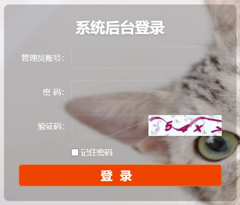
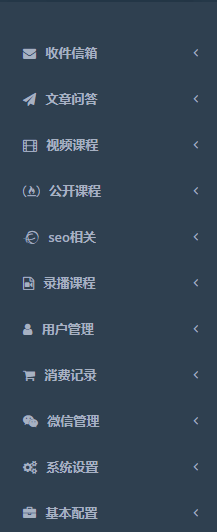
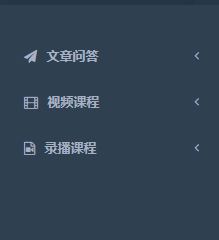
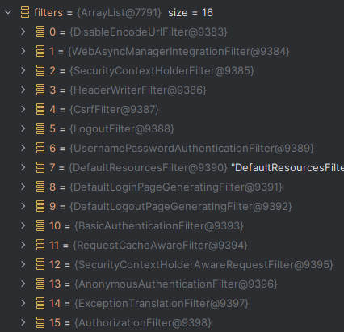

# 1. SpringSecurity框架基础

## 1.1 什么是SpringSecurity

* 作用：做**认证和授权**的

  * 认证：登录

    

  * 授权：权限管理，给用户颁发权限，有些资源不能让用户看，只有有权限的人才能看

    

    

* 官网：https://spring.io/projects/spring-security

  * Spring Security是一个功能强大且高度可定制的**身份认证（登录）和访问控制（权限管理）框架**。它是保护基于 Spring 的应用程序的事实上的标准。(Shiro框架)
  * Spring Security是一个致力于为Java 应用程序提供身份认证和授权的框架。像所有Spring项目一样，Spring Security的真正强大之处在于它可以非常轻松地扩展来满足自定义需求.


## 1.2 SpringSecurity快速上手

* spring security现在开发时不会采用spring进行开发，而是采用spring boot进行开发；spring security本身也是在spring boot流行之后才被大量使用；spring boot流行 2017年。

* 依赖

  ```xml
  <dependency>
      <groupId>org.springframework.boot</groupId>
      <artifactId>spring-boot-starter-security</artifactId>
  </dependency>
  ```

* Controller类

  ```java
  @RestController
  public class UserController {
      @RequestMapping("/hello")
      public String hello(){
          return "Hello, Spring Security!";
      }
  }
  ```

* 访问：http://localhost:8080/hello

  项目中一旦添加了spring security的jar包依赖，那么所有的controller接口路径访问时都会被spring security拦截，它会检查你是否登录，如果未登录，就会跳转到它的一个默认登录页，如果登录了，那么可以直接访问controller的路径；


## 1.3 SpringSecurity基本原理分析

http://localhost:8080/hello --> http://localhost:8080/login 

1. 采用重定向跳转到登录页面；

2. Spring Security采用16个Filter进行过滤拦截；（基于session）

   

   * 入口：`FilterChainProxy`

   * 代码: `doFilterInternal`方法

     ```java
     List<Filter> filters = this.getFilters((HttpServletRequest) firewallRequest);
     ```

   * 生成登录的页面：`DefaultLoginPageGeneratingFilter`

   * 生成退出的页面：`DefaultLogoutPageGeneratingFilter`

   * 登录跳转地址是： /login (这是Spring Security框架提供的，不是我们写的)

   * 退出跳转地址是： /logout (这是Spring Security框架提供的，不是我们写的)

   * 默认情况下，用户名是user，密码是临时生成的uuid（默认密码会在启动SpringBoot应用时输出到控制台）；（来自SecurityProperties类）

   * 可以修改默认的用户名和密码，在配置文件application.properties中配置

     ```properties
     #自己指定登录的用户名和密码
     spring.security.user.name=cat
     spring.security.user.password=aaa111
     ```


# 2. SpringSecurity框架登录认证

## 2.1 基于数据库查询登录

* Controller类

  ```java
  @RestController
  public class UserController {
      @RequestMapping("/")
      public String index(){
          return "Welcome to Spring Security";
      }
  }
  ```

* Service接口

  ```java
  // 我们处理登录的service接口，需要集成SpringSecurity框架的UserDetailsService接口
  public interface UserService extends UserDetailsService {
  }
  ```

* Service实现类

  ```java
  @Service
  public class UserServiceImpl implements UserService {
      @Autowired
      private TUserMapper tUserMapper;
  
      /**
       * 这个方法是在UserDetailsService接口中定义的
       * 该方法会在SpringSecurity框架登录的时候登录
       * @param username
       * @return
       * @throws UsernameNotFoundException
       */
      @Override
      public UserDetails loadUserByUsername(String username) throws UsernameNotFoundException {
          // 查询数据库，查询页面传递的用户名是否在数据库中存在
          TUser tUser = tUserMapper.selectByLogiznAct(username);
          if (tUser == null) {
              // UsernameNotFoundException异常是SpringSecurity框架提供的
              throw new UsernameNotFoundException("登录账号不存在");
          }
  
          // 注意：以下的User类是SpringSecurity框架中的User类
          // 该User类实现了UserDetails接口
          UserDetails userDetails = User.builder()
                  .username(tUser.getLoginAct())
                  .password(tUser.getLoginPwd())
                  .authorities(AuthorityUtils.NO_AUTHORITIES) // 设置权限是空
                  .build();
          // 把UserDetails（User）返回给框架之后，框架会采用密码加密器进行密码的比较
          return userDetails;
      }
  }
  ```

  **注意：重点是编写Service接口要继承UserDetailsService接口，Service实现类要重写loadUserByUsername方法**

* 运行时报错：

  * 老版本报错：`java.lang.IllegalArgumentException`:You have entered a password with no PasswordEncoder
  * 新版本报错：Given that there is no default password encoder configured, each password must have a password encoding prefix. Please either prefix this password with '{noop}' or set a default password encoder in `DelegatingPasswordEncoder`.

* 这是因为没有加入**密码加密器**导致的；

  ```java
  @Configuration
  public class SecurityConfig {
      @Bean
      public PasswordEncoder passwordEncoder() {
          return new BCryptPasswordEncoder();
      }
  }
  ```


## 2.2 数据库登录流程分析

1、访问http://localhost:8080/  

2、被spring security的filter过滤器拦截（里面有16个Filter）； 

3、由于没有登录过，所以spring security就跳转到登录页（登录页是框架生成的）

4、我们在登录页输入账号和密码去登录提交；（账号和密码是数据库的账号密码）

5、spring security里面的UsernamePasswordAuthenticationFilter接收账号和密码；

6、第5步的这个filter会调用loadUserByUsername(String username)方法去数据库查询用户；

7、从数据库查询到用户后，把用户组装成UserDetail对象，然后返回给SpringSecurity框架；

8、第7步返回后，再回到框架的filter里面进行用户状态的判断，用户对象中默认有4个状态字段，如果这4个状态字段的值都是true，该用户才能登录，否则就是提示用户状态不正常，不能登录的（框架中实际上只判断3个状态值，那个密码是否过期没有做判断）；

9、第7步返回后，再回到框架的filter里面进行密码的匹配，如果密码匹配上了，就登录成功，否则失败；

10、比较密码代码：

* 首先执行`UsernamePasswordAuthenticationFilter`类的`attemptAuthentication`方法

* 然后执行到`AbstractUserDetailsAuthenticationProvider`类的`authenticate`方法：

  ```java
  this.additionalAuthenticationChecks(user, (UsernamePasswordAuthenticationToken)authentication);
  ```

* `additionalAuthenticationChecks`方法的核心代码

  ```java
  String presentedPassword = authentication.getCredentials().toString();
  // 调用密码加密器passwordEncoder的matches方法，传入明文密码presentedPassword和密文密码进行密码的比较
  if (!this.passwordEncoder.matches(presentedPassword, userDetails.getPassword())) {
      this.logger.debug("Failed to authenticate since password does not match stored value");
      throw new BadCredentialsException(this.messages.getMessage("AbstractUserDetailsAuthenticationProvider.badCredentials", "Bad credentials"));
  }
  ```


## 2.3 自定义登录页

* Controller

  ```java
  @Controller
  public class UserController {
      @RequestMapping("/")
      @ResponseBody
      public String index(){
          return "Welcome to Spring Security";
      }
  
      @RequestMapping("/toLogin")
      public String toLogin(){
          return "login"; // 跳转到login.html页面
      }
  }
  ```

* 准备登录页面（前后端不分离，使用thymeleaf模版技术搭建登录页面）

  * 添加依赖

  * 在resources/templates/目录下新建login.html

    ```html
    <!DOCTYPE html>
    <html lang="en">
    <head>
        <meta charset="UTF-8">
        <title>登录</title>
    </head>
    <body>
        <form action="/user/login" method="post">
            账号：<input type="text" name="username"/><br/>
            密码：<input type="password" name="password"/><br>
            <!-- 登录页面需要有这个隐藏域 -->
            <input name="_csrf" type="hidden" th:value="${_csrf.token}">
            <input type="submit" value="登录">
        </form>
    </body>
    </html>
    ```

* SecurityConfig

  ```java
  @Configuration
  public class SecurityConfig {
      @Bean
      public PasswordEncoder passwordEncoder() {
          return new BCryptPasswordEncoder();
      }
  
      // 配置SpringSecurity框架的一些行为
      // 配置我们自己的登录页，不使用框架默认的登录页
      // 但是当配置了SecurityFilterChain这个Bean之后，SpringSecurity的某些默认行为就失效了
      // 此时需要加回来
      @Bean
      public SecurityFilterChain securityFilterChain(HttpSecurity httpSecurity) throws Exception { // 安全过滤器Bean
          // SecurityFilterChain是一个接口，DefaultSecurityFilterChain是实现类
          // 在SpringSecurity框架开发时，不是直接new DefaultSecurityFilterChain
          // return new DefaultSecurityFilterChain();
  
          // httpSecurity是Spring容器中的一个Bean，通过参数注入进来
          return httpSecurity
                  // 配置我们自己的登录页
                  .formLogin(t -> {
                      // 框架默认的接受登录提交（form表单）请求的地址是 /login
                      // 需要告诉框架表单提交的地址
                      t.loginProcessingUrl("/user/login")
                       .loginPage("/toLogin");// 定制登录页 (Thymeleaf页面)
                  })
                  // 把所有接口都会进行登录状态检查的默认行为捡回来
                  .authorizeHttpRequests(t -> {
                      t.anyRequest().authenticated(); // 任何请求都需要认证
                  })
                  .build();
      }
  }
  ```

* 启动程序，访问localhost:8080/ ，请求失败，重定向次数过多，原因如下：

  * 浏览器输入地址http://localhost:8080/，此时没登录，需要跳转到登录页面，即请求重定向到"/toLogin"，此时框架检查还是未登录状态，继续跳转登录页面，.......，重定向陷入死循环。

* 因此"/toLogin"请求不需要拦截

  ```java
  @Bean
  public SecurityFilterChain securityFilterChain(HttpSecurity httpSecurity) throws Exception {
      return httpSecurity
              .formLogin(t -> {
                  t.loginProcessingUrl("/user/login") // 表单接收地址
                   .loginPage("/toLogin");// 定制登录页 (Thymeleaf页面)
              })
              .authorizeHttpRequests(t -> {
                  t.requestMatchers("/toLogin").permitAll() // 特殊情况，允许不登录就可以访问
                   .anyRequest().authenticated(); // 任何请求都需要认证
              })
              .build();
  }
  ```


## 2.4 SpringSecurity验证码登录

1. 用户名、密码、图形验证码登录

   * 图形验证码：`java.awt.*`， `javax.swing.*`，Java图形编程
   * 验证码生成：https://www.hutool.cn/ (糊涂) 这个jar包提供了很多工具类

2. 准备登录页面

   ```html
   <!DOCTYPE html>
   <html lang="en">
   <head>
       <meta charset="UTF-8">
       <title>登录</title>
   </head>
   <body>
       <form action="/user/login" method="post">
           账号：<input type="text" name="username"/><br/>
           密码：<input type="password" name="password"/><br>
           验证码：<input type="text" name="captcha">  <br>
           <!-- 登录页面需要有这个隐藏域 -->
           <input name="_csrf" type="hidden" th:value="${_csrf.token}">
           <input type="submit" value="登录">
       </form>
   </body>
   </html>
   ```

3. 编写一个Controller，用于生成验证码

   ```java
   @Controller
   public class CaptchaController {
       @RequestMapping(value = "/common/captcha")
       public void generateCaptcha(HttpServletRequest request, HttpServletResponse response) throws IOException {
           // 生成的是一个验证码的图片,
           // 不需要跳转页面，就是把生成的图片以IO流的方式写出去
   
           // 1.生成验证码图片
           // 方法原型：createCircleCaptcha(图片宽度, 图片高度, 代码个数, 干扰线个数, 字体大小-高度的倍数)
           // ICaptcha iCaptcha = CaptchaUtil.createCircleCaptcha(100, 30, 4, 10, 1); // 验证码包含英文和数字
           // 原型2： createCircleCaptcha(int width, int height, CodeGenerator generator, int circleCount)
           // CodeGenerator验证码生成器 可以自定义验证码生成规则
           ICaptcha iCaptcha = CaptchaUtil.createCircleCaptcha(100, 30, new CodeGenerator() {
               @Override
               public String generate() {
                   return String.valueOf(1000 + new Random().nextInt(9000));
               }
   
               @Override
               public boolean verify(String s, String s1) {
                   return false;
               }
           }, 1);
   
           // 2. 把图片中的验证码字符串（有几个数字）在后端保存起来，前后端不分离项目保存到Session中
           // 后续前端提交过来，后端需要验证提交的验证码对不对
           request.getSession().setAttribute("captcha", iCaptcha.getCode());
   
           // 3. 把生成的验证码图片以IO流的形式写出去
           response.setContentType("image/jpeg"); // 告诉浏览器响应的内容类型是jpeg格式
           iCaptcha.write(response.getOutputStream());
       }
   }
   ```

4. 获取验证码的请求URL为"/common/captcha"，这个URL也会被拦截，需要在配置类中排除这个路径

   ```java
   @Configuration
   public class SecurityConfig {
       @Bean
       public PasswordEncoder passwordEncoder() {
           return new BCryptPasswordEncoder();
       }
       
       @Bean
       public SecurityFilterChain securityFilterChain(HttpSecurity httpSecurity) throws Exception {
           return httpSecurity
                   // 配置我们自己的登录页
                   .formLogin(t -> {
                       t.loginProcessingUrl("/user/login")
                        .loginPage("/toLogin");// 定制登录页 (Thymeleaf页面)
                   })
                   .authorizeHttpRequests(t -> {
                       t.requestMatchers("/toLogin", "/common/captcha").permitAll() // 特殊情况，允许不登录就可以访问
                        .anyRequest().authenticated(); // 任何请求都需要认证
                   })
                   .build();
       }
   }
   ```

5. 此时访问页面时，登录页不输入验证码也可以正常登录，因此还需要自己编写一个验证码过滤器

   ```java
   // OncePerRequestFilter是spring框架提供的一个抽象类
   // 该抽象类实现了Filter接口
   @Component
   public class CaptchaFilter extends OncePerRequestFilter {
   
       @Override
       protected void doFilterInternal(HttpServletRequest request, HttpServletResponse response, FilterChain filterChain) throws ServletException, IOException {
           // 如果不是登录请求，则不需要判断验证码
           String requestURI = request.getRequestURI(); // "/user/login"
           if ("/user/login".equals(requestURI)) {
               // 是登录请求，验证验证码
               // 接收前端的验证码
               String code = request.getParameter("captcha"); // 参数名对应login.html的验证码表单项
               // 生成的验证码存储在session域中，获取session域中的验证码
               String sessionCode = (String) request.getSession().getAttribute("captcha");
               if (!StringUtils.hasText(code)) {
                   // 验证码为空，验证未通过
                   response.sendRedirect("/");
               } else if (!code.equalsIgnoreCase(sessionCode)) {
                   // 如果不相等，验证没通过
                   response.sendRedirect("/");
               } else {
                   // 继续向下执行其他过滤
                   filterChain.doFilter(request, response);
               }
           } else {
               // 不是登录请求，直接放行
               filterChain.doFilter(request, response);
           }
       }
   }
   ```

6. 配置类中需要将这个验证码过滤器添加到过滤器链中

   ```java
   @Configuration
   public class SecurityConfig {
       @Bean
       public PasswordEncoder passwordEncoder() {
           return new BCryptPasswordEncoder();
       }
   
       @Autowired
       private CaptchaFilter captchaFilter;
       
       @Bean
       public SecurityFilterChain securityFilterChain(HttpSecurity httpSecurity) throws Exception {
           return httpSecurity
                   // 配置我们自己的登录页
                   .formLogin(t -> {
                       t.loginProcessingUrl("/user/login")
                        .loginPage("/toLogin");// 定制登录页 (Thymeleaf页面)
                   })
                   .authorizeHttpRequests(t -> {
                       t.requestMatchers("/toLogin", "/common/captcha").permitAll() // 特殊情况，允许不登录就可以访问
                        .anyRequest().authenticated(); // 任何请求都需要认证
                   })
                   // 将验证码过滤器添加到接收登录账号密码的filter之前
                   .addFilterBefore(captchaFilter, UsernamePasswordAuthenticationFilter.class)
                   .build();
       }
   }
   ```


## 2.5 验证码登录流程分析

1.  访问http://localhost:8080/

2.  被SpringSecurity的filter过滤器拦截（16个Filter）

3.  由于没有登录过，所以spring security就跳转到自定义的登录页login.html；

4.  我们在登录页输入账号、密码、验证码 去提交登录；

5.  ` CaptchaFilter`（我们写的）拦截登录请求，验证一下验证码对不对；

6.  验证码正确，就执行下一个Filter，调用`UsernamePasswordAuthenticationFilter`（Spring Security框架的）接收账号和密码.

7.  `UserDetailsService.loadUserByUsername()`（我们的`UserServiceImpl`覆盖该方法）--> `userMaper`（mybatis）--> 查数据库 --> 返回`userDetail `(框架的)；

8.  把`userDetail` 返回给（框架）进行用户状态检查和密码比较；

   * `this.additionalAuthenticationChecks(user, (UsernamePasswordAuthenticationToken)authentication);`

   * `DaoAuthenticationProvider`类的`additionalAuthenticationChecks(..)`方法里面

     `this.passwordEncoder.matches(presentedPassword, userDetails.getPassword())`进行密码匹配，匹配上了，则认证（登录）成功，否则认证失败；


## 2.6 密码加密和密码匹配

对于用户密码的保护，通常都会进行**加密**然后存放在数据库中；（基本常识）

* 目前密码加密MD5和BCrypt比较流行，Spring Security默认是采用BCrypt；

* Spring Security密码加密接口：PasswordEncoder；

我们对123字符串加密三次，然后匹配三次，看看效果：

```java
@Test
public void test01(){
    PasswordEncoder passwordEncoder = new BCryptPasswordEncoder();
    String password = "aaa111";
    String encodedPassword = passwordEncoder.encode(password);// 加密方法
    System.out.println(encodedPassword);//$2a$10$EGqSMZBn3h33vQLCEgbFFeWvs80DlLJ9LGX58PegRq7gsZ48Kt4f2
    // 匹配方法, 第一个参数是明文密码，第二个参数是密文密码
    boolean match = passwordEncoder.matches(password, encodedPassword);
    System.out.println(match); //true

    // 对同一个密码再次加密和匹配
    encodedPassword = passwordEncoder.encode(password);
    match = passwordEncoder.matches(password, encodedPassword);
    System.out.println(encodedPassword);//$2a$10$pUK65TIQrjpQ.nMgzPG5oefA1.4ekpEp9.B.AyA1PbnCWp101Y8Ga
    System.out.println(match); //true

    encodedPassword = passwordEncoder.encode(password);
    match = passwordEncoder.matches(password, encodedPassword);
    System.out.println(encodedPassword);//$2a$10$CjY2AKKqo3cmttb/4Vjd6eHAqRtUDKvSMSdb665KFNxkiN0NnNeVG
    System.out.println(match); //true
}
```

**相同的字符串加密之后的结果都不一样，但是比较的时候是一样的**


## 2.7 BCrypt密码加密和密码匹配原理

* BCrypt加密原理：
  * 输入明文密码，例如aaa111，通过**随机** ***加盐 salt*** 操作之后（随机加盐就是随机加一个字符串），再进行加密得到密文密码，然后存入到数据库
  * 密文密码的格式是固定的：(version + salt + hash) -- 版本号 + 22位盐值 + 加密后的密文

* 密码匹配原理
  * 系统在验证用户的密码时，需要从密文密码xxx中取出盐salt（22位）
  * 然后与用户页面输入的password（aaa111）进行加密
  * 把得到的结果与保存在数据库中的密文xxx进行比对，如果一致才算验证通过；
  * 例子：
    * 明文密码：aaa111
    * 数据库密文：\$2a\$10$   9z08lUjY.Htp4xdWLT7TzO   wrz4MGz4V7tt1m/61HdebDqR2m7Oj52
    * 先拿到密文中的盐值拼接到明文密码后，即(aaa111 + 9z08lUjY.Htp4xdWLT7TzO)，然后加密获得密文，再拿这个密文与数据库中的密文进行比对


## 2.8 获取当前登录用户信息

1. **方式一**： 通过方法参数注入principal

   ```java
   @RequestMapping("/welcome")
   @ResponseBody
   public Object welcome(Principal principal){
       return principal;
   }
   ```

   可以在security配置类中配置登录成功之后跳转的页面

   ```java
   @Bean
   public SecurityFilterChain securityFilterChain(HttpSecurity httpSecurity) throws Exception {
       return httpSecurity
               // 配置我们自己的登录页
               .formLogin(t -> {
                   t.loginProcessingUrl("/user/login")
                    .loginPage("/toLogin") // 定制登录页 (Thymeleaf页面)
                    // 登录成功跳转到"/welcome" 默认跳转到上一次访问的地址
                    .successForwardUrl("/welcome"); 
               })
               .authorizeHttpRequests(t -> {
                   t.requestMatchers("/toLogin", "/common/captcha").permitAll() // 特殊情况，允许不登录就可以访问
                    .anyRequest().authenticated(); // 任何请求都需要认证
               })
               // 将验证码过滤器添加到接收登录账号密码的filter之前
               .addFilterBefore(captchaFilter, UsernamePasswordAuthenticationFilter.class)
               .build();
   }
   ```

   这种方法获取的principal中包含的信息：

   ```json
   {
   	"authorities": [],
   	"details": {
   		"remoteAddress": "0:0:0:0:0:0:0:1",
   		"sessionId": "ECA7A259EE989C12AF3CD2243D77A09F"
   	},
   	"authenticated": true,
   	"principal": {
   		"password": null,
   		"username": "admin",
   		"authorities": [], // 权限
   		"accountNonExpired": true, // 账户是否过期
   		"accountNonLocked": true, // 账户是否锁定
   		"credentialsNonExpired": true, // 密码是否过期
   		"enabled": true
   	},
   	"credentials": null,
   	"name": "admin"
   }
   ```

   **方式一所获取的用户信息太少了，连用户的id都获取不到**

2. **方式二**：

   * 由于我们的UserService接口继承了SpringSecurity框架提供的UserDetailsService接口，UserServiceImpl类实现了UserService接口重写了loadUserByUsername方法，返回了一个实现UserDetails接口的User类型对象，
   * 而这个User类是官方提供的，只有username、password、enabled、accountNonExpired、credentialsNonExpired、accountNonLocked、authorities这些属性。
   * 因此我们需要自己写一个TUser类实现UserDetails接口，并在loadUserByUsername方法中返回自己定义的TUser类型的对象即可。

   我们自己的TUser类

   ```java
   @Data
   public class TUser implements Serializable, UserDetails {
       /**
        * 主键，自动增长，用户ID
        */
       private Integer id;
   
       /**
        * 登录账号
        */
       @JsonIgnore // 返回给前端时忽略该字段，不参与Json转换
       private String loginAct;
   
       /**
        * 登录密码
        */
       @JsonIgnore // 返回给前端时忽略该字段，不参与Json转换
       private String loginPwd;
   
       /**
        * 用户姓名
        */
       private String name;
   
       /**
        * 用户手机
        */
       private String phone;
   
       /**
        * 用户邮箱
        */
       private String email;
   
       /**
        * 账户是否没有过期，0已过期 1正常
        */
       private Integer accountNoExpired;
   
       /**
        * 密码是否没有过期，0已过期 1正常
        */
       private Integer credentialsNoExpired;
   
       /**
        * 账号是否没有锁定，0已锁定 1正常
        */
       private Integer accountNoLocked;
   
       /**
        * 账号是否启用，0禁用 1启用
        */
       private Integer accountEnabled;
   
       /**
        * 创建时间
        */
       @JsonFormat(pattern = "yyyy-MM-dd HH:mm:ss", timezone = "GMT+8") // 格式化日期,设置时区为东8区
       private Date createTime;
   
       /**
        * 创建人
        */
       private Integer createBy;
   
       /**
        * 编辑时间
        */
       @JsonFormat(pattern = "yyyy-MM-dd HH:mm:ss", timezone = "GMT+8") // 格式化日期,设置时区为东8区
       private Date editTime;
   
       /**
        * 编辑人
        */
       private Integer editBy;
   
       /**
        * 最近登录时间
        */
       @JsonFormat(pattern = "yyyy-MM-dd HH:mm:ss", timezone = "GMT+8") // 格式化日期,设置时区为东8区
       private Date lastLoginTime;
   
       private static final long serialVersionUID = 1L;
   
       // --------------------实现UserDetails接口的方法(有四个默认方法可以不实现)------------------------------
       @Override
       public Collection<? extends GrantedAuthority> getAuthorities() {
           return List.of(); // 返回一个空的权限集合
       }
   
       @Override
       @JsonIgnore // 返回给前端时忽略该字段，不参与Json转换
       public String getPassword() {
           return this.loginPwd;
       }
   
       @Override
       public String getUsername() {
           return this.getLoginAct();
       }
   
       @Override
       public boolean isAccountNonExpired() {
           return this.accountNoExpired == 1; // 1表示未过期
       }
   
       @Override
       public boolean isAccountNonLocked() {
           return this.accountNoLocked == 1;
       }
   
       @Override
       public boolean isCredentialsNonExpired() {
           return this.credentialsNoExpired == 1;
       }
   
       @Override
       public boolean isEnabled() {
           return this.accountEnabled == 1;
       }
   }
   ```

   **jackson的两个注解：**

   * `@JsonIgnore`：转换json时忽略某个属性

   * `@JsonFormat`：指定日期格式和时区

     可以在SpringBoot的application.yaml配置文件中对日期转换进行配置

     ```yml
     spring:
     	jackson:
     		time-zone: GMT+8
             date-format: yyyy-MM-dd HH:mm:ss
     ```

     

   UserServiceImpl类：

   ```java
   @Service
   public class UserServiceImpl implements UserService {
       @Autowired
       private TUserMapper tUserMapper;
   
       /**
        * 这个方法是在UserDetailsService接口中定义的
        * 该方法会在SpringSecurity框架登录的时候登录
        * @param username
        * @return
        * @throws UsernameNotFoundException
        */
       @Override
       public UserDetails loadUserByUsername(String username) throws UsernameNotFoundException {
           // 查询数据库，查询页面传递的用户名是否在数据库中存在
           TUser tUser = tUserMapper.selectByLogiznAct(username);
           if (tUser == null) {
               // UsernameNotFoundException异常是SpringSecurity框架提供的
               throw new UsernameNotFoundException("登录账号不存在");
           }
   
           return tUser;
       }
   }
   ```

3. **方式三**：可以使用Principal接口的子接口Authentication注入参数，也可以使用Authentication接口的实现类UsernamePasswordAuthenticationToken注入参数。

   ```java
   import org.springframework.security.core.Authentication;
   
   @RequestMapping("/welcome2")
   @ResponseBody
   public Object welcome2(Authentication authentication){
       return authentication;
   }
   
   @RequestMapping("/welcome3")
   @ResponseBody
   public Object welcome3(UsernamePasswordAuthenticationToken token){
       return token;
   }
   ```

4. **方式4**：通过SecurityContextHolder

   ```java
   @RequestMapping("/welcome4")
   @ResponseBody
   public Object welcome4(){
       // 获取安全认证信息
       return SecurityContextHolder.getContext().getAuthentication();
   }
   ```

   **一般实际开发中会写一个工具类，工具类中写一个静态方法，使用上面方式4的代码来获取登录人信息**

   ```java
   public class LoginInfoUtil {
       public static TUser getCurrentLoginUser(){
           Authentication authentication = SecurityContextHolder.getContext().getAuthentication();
           TUser tUser = (TUser) authentication.getPrincipal();
           return tUser;
       }
   }
   ```

   
