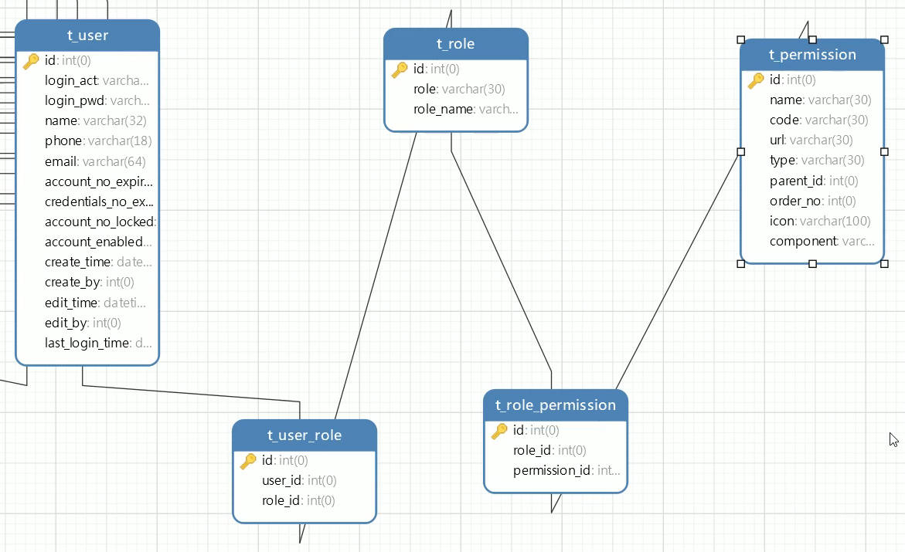
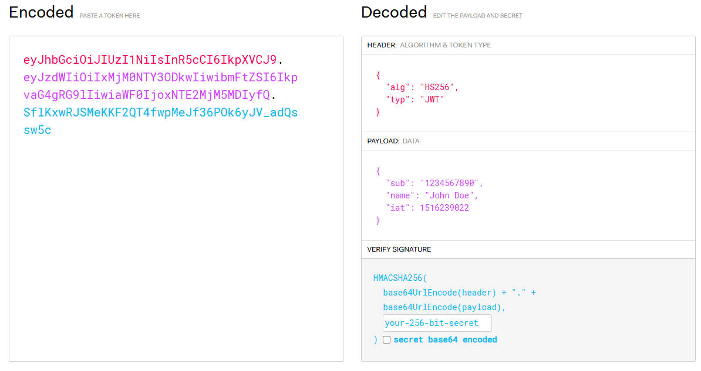

# 1. 基础

## 1.1 什么是SpringSecurity

* 作用：做**认证和授权**的

  * 认证：登录

    

  * 授权：权限管理，给用户颁发权限，有些资源不能让用户看，只有有权限的人才能看

    

    

* 官网：https://spring.io/projects/spring-security

  * Spring Security是一个功能强大且高度可定制的**身份认证（登录）和访问控制（权限管理）框架**。它是保护基于 Spring 的应用程序的事实上的标准。(Shiro框架)
  * Spring Security是一个致力于为Java 应用程序提供身份认证和授权的框架。像所有Spring项目一样，Spring Security的真正强大之处在于它可以非常轻松地扩展来满足自定义需求.


## 1.2 SpringSecurity快速上手

* spring security现在开发时不会采用spring进行开发，而是采用spring boot进行开发；spring security本身也是在spring boot流行之后才被大量使用；spring boot流行 2017年。

* 依赖

  ```xml
  <dependency>
      <groupId>org.springframework.boot</groupId>
      <artifactId>spring-boot-starter-security</artifactId>
  </dependency>
  ```

* Controller类

  ```java
  @RestController
  public class UserController {
      @RequestMapping("/hello")
      public String hello(){
          return "Hello, Spring Security!";
      }
  }
  ```

* 访问：http://localhost:8080/hello

  项目中一旦添加了spring security的jar包依赖，那么所有的controller接口路径访问时都会被spring security拦截，它会检查你是否登录，如果未登录，就会跳转到它的一个默认登录页，如果登录了，那么可以直接访问controller的路径；


## 1.3 SpringSecurity基本原理分析

http://localhost:8080/hello --> http://localhost:8080/login 

1. 采用重定向跳转到登录页面；

2. Spring Security采用16个Filter进行过滤拦截；（基于session）

   

   * 入口：`FilterChainProxy`

   * 代码: `doFilterInternal`方法

     ```java
     List<Filter> filters = this.getFilters((HttpServletRequest) firewallRequest);
     ```

   * 生成登录的页面：`DefaultLoginPageGeneratingFilter`

   * 生成退出的页面：`DefaultLogoutPageGeneratingFilter`

   * 登录跳转地址是： /login (这是Spring Security框架提供的，不是我们写的)

   * 退出跳转地址是： /logout (这是Spring Security框架提供的，不是我们写的)

   * 默认情况下，用户名是user，密码是临时生成的uuid（默认密码会在启动SpringBoot应用时输出到控制台）；（来自SecurityProperties类）

   * 可以修改默认的用户名和密码，在配置文件application.properties中配置

     ```properties
     #自己指定登录的用户名和密码
     spring.security.user.name=cat
     spring.security.user.password=aaa111
     ```


# 2. 登录认证

## 2.1 基于数据库查询登录

* Controller类

  ```java
  @RestController
  public class UserController {
      @RequestMapping("/")
      public String index(){
          return "Welcome to Spring Security";
      }
  }
  ```

* Service接口

  ```java
  // 我们处理登录的service接口，需要集成SpringSecurity框架的UserDetailsService接口
  public interface UserService extends UserDetailsService {
  }
  ```

* Service实现类

  ```java
  @Service
  public class UserServiceImpl implements UserService {
      @Autowired
      private TUserMapper tUserMapper;
  
      /**
       * 这个方法是在UserDetailsService接口中定义的
       * 该方法会在SpringSecurity框架登录的时候登录
       * @param username
       * @return
       * @throws UsernameNotFoundException
       */
      @Override
      public UserDetails loadUserByUsername(String username) throws UsernameNotFoundException {
          // 查询数据库，查询页面传递的用户名是否在数据库中存在
          TUser tUser = tUserMapper.selectByLogiznAct(username);
          if (tUser == null) {
              // UsernameNotFoundException异常是SpringSecurity框架提供的
              throw new UsernameNotFoundException("登录账号不存在");
          }
  
          // 注意：以下的User类是SpringSecurity框架中的User类
          // 该User类实现了UserDetails接口
          UserDetails userDetails = User.builder()
                  .username(tUser.getLoginAct())
                  .password(tUser.getLoginPwd())
                  .authorities(AuthorityUtils.NO_AUTHORITIES) // 设置权限是空
                  .build();
          // 把UserDetails（User）返回给框架之后，框架会采用密码加密器进行密码的比较
          return userDetails;
      }
  }
  ```

  **注意：重点是编写Service接口要继承UserDetailsService接口，Service实现类要重写loadUserByUsername方法**

* 运行时报错：

  * 老版本报错：`java.lang.IllegalArgumentException`:You have entered a password with no PasswordEncoder
  * 新版本报错：Given that there is no default password encoder configured, each password must have a password encoding prefix. Please either prefix this password with '{noop}' or set a default password encoder in `DelegatingPasswordEncoder`.

* 这是因为没有加入**密码加密器**导致的；

  ```java
  @Configuration
  public class SecurityConfig {
      @Bean
      public PasswordEncoder passwordEncoder() {
          return new BCryptPasswordEncoder();
      }
  }
  ```


## 2.2 数据库登录流程分析

1、访问http://localhost:8080/  

2、被spring security的filter过滤器拦截（里面有16个Filter）； 

3、由于没有登录过，所以spring security就跳转到登录页（登录页是框架生成的）

4、我们在登录页输入账号和密码去登录提交；（账号和密码是数据库的账号密码）

5、spring security里面的UsernamePasswordAuthenticationFilter接收账号和密码；

6、第5步的这个filter会调用loadUserByUsername(String username)方法去数据库查询用户；

7、从数据库查询到用户后，把用户组装成UserDetail对象，然后返回给SpringSecurity框架；

8、第7步返回后，再回到框架的filter里面进行用户状态的判断，用户对象中默认有4个状态字段，如果这4个状态字段的值都是true，该用户才能登录，否则就是提示用户状态不正常，不能登录的（框架中实际上只判断3个状态值，那个密码是否过期没有做判断）；

9、第7步返回后，再回到框架的filter里面进行密码的匹配，如果密码匹配上了，就登录成功，否则失败；

10、比较密码代码：

* 首先执行`UsernamePasswordAuthenticationFilter`类的`attemptAuthentication`方法

* 然后执行到`AbstractUserDetailsAuthenticationProvider`类的`authenticate`方法：

  ```java
  this.additionalAuthenticationChecks(user, (UsernamePasswordAuthenticationToken)authentication);
  ```

* `additionalAuthenticationChecks`方法的核心代码

  ```java
  String presentedPassword = authentication.getCredentials().toString();
  // 调用密码加密器passwordEncoder的matches方法，传入明文密码presentedPassword和密文密码进行密码的比较
  if (!this.passwordEncoder.matches(presentedPassword, userDetails.getPassword())) {
      this.logger.debug("Failed to authenticate since password does not match stored value");
      throw new BadCredentialsException(this.messages.getMessage("AbstractUserDetailsAuthenticationProvider.badCredentials", "Bad credentials"));
  }
  ```


## 2.3 自定义登录页

* Controller

  ```java
  @Controller
  public class UserController {
      @RequestMapping("/")
      @ResponseBody
      public String index(){
          return "Welcome to Spring Security";
      }
  
      @RequestMapping("/toLogin")
      public String toLogin(){
          return "login"; // 跳转到login.html页面
      }
  }
  ```

* 准备登录页面（前后端不分离，使用thymeleaf模版技术搭建登录页面）

  * 添加依赖

  * 在resources/templates/目录下新建login.html

    ```html
    <!DOCTYPE html>
    <html lang="en">
    <head>
        <meta charset="UTF-8">
        <title>登录</title>
    </head>
    <body>
        <form action="/user/login" method="post">
            账号：<input type="text" name="username"/><br/>
            密码：<input type="password" name="password"/><br>
            <!-- 登录页面需要有这个隐藏域 -->
            <input name="_csrf" type="hidden" th:value="${_csrf.token}">
            <input type="submit" value="登录">
        </form>
    </body>
    </html>
    ```

* SecurityConfig

  ```java
  @Configuration
  public class SecurityConfig {
      @Bean
      public PasswordEncoder passwordEncoder() {
          return new BCryptPasswordEncoder();
      }
  
      // 配置SpringSecurity框架的一些行为
      // 配置我们自己的登录页，不使用框架默认的登录页
      // 但是当配置了SecurityFilterChain这个Bean之后，SpringSecurity的某些默认行为就失效了
      // 此时需要加回来
      @Bean
      public SecurityFilterChain securityFilterChain(HttpSecurity httpSecurity) throws Exception { // 安全过滤器Bean
          // SecurityFilterChain是一个接口，DefaultSecurityFilterChain是实现类
          // 在SpringSecurity框架开发时，不是直接new DefaultSecurityFilterChain
          // return new DefaultSecurityFilterChain();
  
          // httpSecurity是Spring容器中的一个Bean，通过参数注入进来
          return httpSecurity
                  // 配置我们自己的登录页
                  .formLogin(t -> {
                      // 框架默认的接受登录提交（form表单）请求的地址是 /login
                      // 需要告诉框架表单提交的地址
                      t.loginProcessingUrl("/user/login")
                       .loginPage("/toLogin");// 定制登录页 (Thymeleaf页面)
                  })
                  // 把所有接口都会进行登录状态检查的默认行为捡回来
                  .authorizeHttpRequests(t -> {
                      t.anyRequest().authenticated(); // 任何请求都需要认证
                  })
                  .build();
      }
  }
  ```

* 启动程序，访问localhost:8080/ ，请求失败，重定向次数过多，原因如下：

  * 浏览器输入地址http://localhost:8080/，此时没登录，需要跳转到登录页面，即请求重定向到"/toLogin"，此时框架检查还是未登录状态，继续跳转登录页面，.......，重定向陷入死循环。

* 因此"/toLogin"请求不需要拦截 

  ```java
  @Bean
  public SecurityFilterChain securityFilterChain(HttpSecurity httpSecurity) throws Exception {
      return httpSecurity
              .formLogin(t -> {
                  t.loginProcessingUrl("/user/login") // 表单接收地址
                   .loginPage("/toLogin");// 定制登录页 (Thymeleaf页面)
              })
              .authorizeHttpRequests(t -> {
                  t.requestMatchers("/toLogin").permitAll() // 特殊情况，允许不登录就可以访问
                   .anyRequest().authenticated(); // 任何请求都需要认证
              })
              .build();
  }
  ```

**注意："/user/login"这个地址并没有配置为特殊情况，但是却不需要认证就可以访问，是因为SpringSecurity提供的地址是不会被拦截的**。


## 2.4 SpringSecurity验证码登录

1. 用户名、密码、图形验证码登录

   * 图形验证码：`java.awt.*`， `javax.swing.*`，Java图形编程
   * 验证码生成：https://www.hutool.cn/ (糊涂) 这个jar包提供了很多工具类

2. 准备登录页面

   ```html
   <!DOCTYPE html>
   <html lang="en">
   <head>
       <meta charset="UTF-8">
       <title>登录</title>
   </head>
   <body>
       <form action="/user/login" method="post">
           账号：<input type="text" name="username"/><br/>
           密码：<input type="password" name="password"/><br>
           验证码：<input type="text" name="captcha">  <br>
           <!-- 登录页面需要有这个隐藏域 -->
           <input name="_csrf" type="hidden" th:value="${_csrf.token}">
           <input type="submit" value="登录">
       </form>
   </body>
   </html>
   ```

3. 编写一个Controller，用于生成验证码

   ```java
   @Controller
   public class CaptchaController {
       @RequestMapping(value = "/common/captcha")
       public void generateCaptcha(HttpServletRequest request, HttpServletResponse response) throws IOException {
           // 生成的是一个验证码的图片,
           // 不需要跳转页面，就是把生成的图片以IO流的方式写出去
   
           // 1.生成验证码图片
           // 方法原型：createCircleCaptcha(图片宽度, 图片高度, 代码个数, 干扰线个数, 字体大小-高度的倍数)
           // ICaptcha iCaptcha = CaptchaUtil.createCircleCaptcha(100, 30, 4, 10, 1); // 验证码包含英文和数字
           // 原型2： createCircleCaptcha(int width, int height, CodeGenerator generator, int circleCount)
           // CodeGenerator验证码生成器 可以自定义验证码生成规则
           ICaptcha iCaptcha = CaptchaUtil.createCircleCaptcha(100, 30, new CodeGenerator() {
               @Override
               public String generate() {
                   return String.valueOf(1000 + new Random().nextInt(9000));
               }
   
               @Override
               public boolean verify(String s, String s1) {
                   return false;
               }
           }, 1);
   
           // 2. 把图片中的验证码字符串（有几个数字）在后端保存起来，前后端不分离项目保存到Session中
           // 后续前端提交过来，后端需要验证提交的验证码对不对
           request.getSession().setAttribute("captcha", iCaptcha.getCode());
   
           // 3. 把生成的验证码图片以IO流的形式写出去
           response.setContentType("image/jpeg"); // 告诉浏览器响应的内容类型是jpeg格式
           iCaptcha.write(response.getOutputStream());
       }
   }
   ```

4. 获取验证码的请求URL为"/common/captcha"，这个URL也会被拦截，需要在配置类中排除这个路径

   ```java
   @Configuration
   public class SecurityConfig {
       @Bean
       public PasswordEncoder passwordEncoder() {
           return new BCryptPasswordEncoder();
       }
       
       @Bean
       public SecurityFilterChain securityFilterChain(HttpSecurity httpSecurity) throws Exception {
           return httpSecurity
                   // 配置我们自己的登录页
                   .formLogin(t -> {
                       t.loginProcessingUrl("/user/login")
                        .loginPage("/toLogin");// 定制登录页 (Thymeleaf页面)
                   })
                   .authorizeHttpRequests(t -> {
                       t.requestMatchers("/toLogin", "/common/captcha").permitAll() // 特殊情况，允许不登录就可以访问
                        .anyRequest().authenticated(); // 任何请求都需要认证
                   })
                   .build();
       }
   }
   ```

5. 此时访问页面时，登录页不输入验证码也可以正常登录，因此还需要自己编写一个验证码过滤器

   ```java
   // OncePerRequestFilter是spring框架提供的一个抽象类
   // 该抽象类实现了Filter接口
   @Component
   public class CaptchaFilter extends OncePerRequestFilter {
   
       @Override
       protected void doFilterInternal(HttpServletRequest request, HttpServletResponse response, FilterChain filterChain) throws ServletException, IOException {
           // 如果不是登录请求，则不需要判断验证码
           String requestURI = request.getRequestURI(); // "/user/login"
           if ("/user/login".equals(requestURI)) {
               // 是登录请求，验证验证码
               // 接收前端的验证码
               String code = request.getParameter("captcha"); // 参数名对应login.html的验证码表单项
               // 生成的验证码存储在session域中，获取session域中的验证码
               String sessionCode = (String) request.getSession().getAttribute("captcha");
               if (!StringUtils.hasText(code)) {
                   // 验证码为空，验证未通过
                   response.sendRedirect("/");
               } else if (!code.equalsIgnoreCase(sessionCode)) {
                   // 如果不相等，验证没通过
                   response.sendRedirect("/");
               } else {
                   // 继续向下执行其他过滤
                   filterChain.doFilter(request, response);
               }
           } else {
               // 不是登录请求，直接放行
               filterChain.doFilter(request, response);
           }
       }
   }
   ```

6. 配置类中需要将这个验证码过滤器添加到过滤器链中

   ```java
   @Configuration
   public class SecurityConfig {
       @Bean
       public PasswordEncoder passwordEncoder() {
           return new BCryptPasswordEncoder();
       }
   
       @Autowired
       private CaptchaFilter captchaFilter;
       
       @Bean
       public SecurityFilterChain securityFilterChain(HttpSecurity httpSecurity) throws Exception {
           return httpSecurity
                   // 配置我们自己的登录页
                   .formLogin(t -> {
                       t.loginProcessingUrl("/user/login")
                        .loginPage("/toLogin");// 定制登录页 (Thymeleaf页面)
                   })
                   .authorizeHttpRequests(t -> {
                       t.requestMatchers("/toLogin", "/common/captcha").permitAll() // 特殊情况，允许不登录就可以访问
                        .anyRequest().authenticated(); // 任何请求都需要认证
                   })
                   // 将验证码过滤器添加到接收登录账号密码的filter之前
                   .addFilterBefore(captchaFilter, UsernamePasswordAuthenticationFilter.class)
                   .build();
       }
   }
   ```


## 2.5 验证码登录流程分析

1.  访问http://localhost:8080/

2.  被SpringSecurity的filter过滤器拦截（16个Filter）

3.  由于没有登录过，所以spring security就跳转到自定义的登录页login.html；

4.  我们在登录页输入账号、密码、验证码 去提交登录；

5.  ` CaptchaFilter`（我们写的）拦截登录请求，验证一下验证码对不对；

6.  验证码正确，就执行下一个Filter，调用`UsernamePasswordAuthenticationFilter`（Spring Security框架的）接收账号和密码.

7.  `UserDetailsService.loadUserByUsername()`（我们的`UserServiceImpl`覆盖该方法）--> `userMaper`（mybatis）--> 查数据库 --> 返回`userDetail `(框架的)；

8.  把`userDetail` 返回给（框架）进行用户状态检查和密码比较；

   * `this.additionalAuthenticationChecks(user, (UsernamePasswordAuthenticationToken)authentication);`

   * `DaoAuthenticationProvider`类的`additionalAuthenticationChecks(..)`方法里面

     `this.passwordEncoder.matches(presentedPassword, userDetails.getPassword())`进行密码匹配，匹配上了，则认证（登录）成功，否则认证失败；


## 2.6 密码加密和密码匹配

对于用户密码的保护，通常都会进行**加密**然后存放在数据库中；（基本常识）

* 目前密码加密MD5和BCrypt比较流行，Spring Security默认是采用BCrypt；

* Spring Security密码加密接口：PasswordEncoder；

我们对123字符串加密三次，然后匹配三次，看看效果：

```java
@Test
public void test01(){
    PasswordEncoder passwordEncoder = new BCryptPasswordEncoder();
    String password = "aaa111";
    String encodedPassword = passwordEncoder.encode(password);// 加密方法
    System.out.println(encodedPassword);//$2a$10$EGqSMZBn3h33vQLCEgbFFeWvs80DlLJ9LGX58PegRq7gsZ48Kt4f2
    // 匹配方法, 第一个参数是明文密码，第二个参数是密文密码
    boolean match = passwordEncoder.matches(password, encodedPassword);
    System.out.println(match); //true

    // 对同一个密码再次加密和匹配
    encodedPassword = passwordEncoder.encode(password);
    match = passwordEncoder.matches(password, encodedPassword);
    System.out.println(encodedPassword);//$2a$10$pUK65TIQrjpQ.nMgzPG5oefA1.4ekpEp9.B.AyA1PbnCWp101Y8Ga
    System.out.println(match); //true

    encodedPassword = passwordEncoder.encode(password);
    match = passwordEncoder.matches(password, encodedPassword);
    System.out.println(encodedPassword);//$2a$10$CjY2AKKqo3cmttb/4Vjd6eHAqRtUDKvSMSdb665KFNxkiN0NnNeVG
    System.out.println(match); //true
}
```

**相同的字符串加密之后的结果都不一样，但是比较的时候是一样的**


## 2.7 BCrypt密码加密和密码匹配原理

* BCrypt加密原理：
  * 输入明文密码，例如aaa111，通过**随机** ***加盐 salt*** 操作之后（随机加盐就是随机加一个字符串），再进行加密得到密文密码，然后存入到数据库
  * 密文密码的格式是固定的：(version + salt + hash) -- 版本号 + 22位盐值 + 加密后的密文

* 密码匹配原理
  * 系统在验证用户的密码时，需要从密文密码xxx中取出盐salt（22位）
  * 然后与用户页面输入的password（aaa111）进行加密
  * 把得到的结果与保存在数据库中的密文xxx进行比对，如果一致才算验证通过；
  * 例子：
    * 明文密码：aaa111
    * 数据库密文：\$2a\$10$   9z08lUjY.Htp4xdWLT7TzO   wrz4MGz4V7tt1m/61HdebDqR2m7Oj52
    * 先拿到密文中的盐值拼接到明文密码后，即(aaa111 + 9z08lUjY.Htp4xdWLT7TzO)，然后加密获得密文，再拿这个密文与数据库中的密文进行比对


## 2.8 获取当前登录用户信息

1. **方式一**： 通过方法参数注入principal

   ```java
   @RequestMapping("/welcome")
   @ResponseBody
   public Object welcome(Principal principal){
       return principal;
   }
   ```

   可以在security配置类中配置登录成功之后跳转的页面

   ```java
   @Bean
   public SecurityFilterChain securityFilterChain(HttpSecurity httpSecurity) throws Exception {
       return httpSecurity
               // 配置我们自己的登录页
               .formLogin(t -> {
                   t.loginProcessingUrl("/user/login")
                    .loginPage("/toLogin") // 定制登录页 (Thymeleaf页面)
                    // 登录成功跳转到"/welcome" 默认跳转到上一次访问的地址
                    .successForwardUrl("/welcome"); 
               })
               .authorizeHttpRequests(t -> {
                   t.requestMatchers("/toLogin", "/common/captcha").permitAll() // 特殊情况，允许不登录就可以访问
                    .anyRequest().authenticated(); // 任何请求都需要认证
               })
               // 将验证码过滤器添加到接收登录账号密码的filter之前
               .addFilterBefore(captchaFilter, UsernamePasswordAuthenticationFilter.class)
               .build();
   }
   ```

   这种方法获取的principal中包含的信息：

   ```json
   {
   	"authorities": [],
   	"details": {
   		"remoteAddress": "0:0:0:0:0:0:0:1",
   		"sessionId": "ECA7A259EE989C12AF3CD2243D77A09F"
   	},
   	"authenticated": true,
   	"principal": {
   		"password": null,
   		"username": "admin",
   		"authorities": [], // 权限
   		"accountNonExpired": true, // 账户是否过期
   		"accountNonLocked": true, // 账户是否锁定
   		"credentialsNonExpired": true, // 密码是否过期
   		"enabled": true
   	},
   	"credentials": null,
   	"name": "admin"
   }
   ```

   **方式一所获取的用户信息太少了，连用户的id都获取不到**

2. **方式二**：

   * 由于我们的UserService接口继承了SpringSecurity框架提供的UserDetailsService接口，UserServiceImpl类实现了UserService接口重写了loadUserByUsername方法，返回了一个实现UserDetails接口的User类型对象，
   * 而这个User类是官方提供的，只有username、password、enabled、accountNonExpired、credentialsNonExpired、accountNonLocked、authorities这些属性。
   * 因此我们需要自己写一个TUser类实现UserDetails接口，并在loadUserByUsername方法中返回自己定义的TUser类型的对象即可。

   我们自己的TUser类

   ```java
   @Data
   public class TUser implements Serializable, UserDetails {
       /**
        * 主键，自动增长，用户ID
        */
       private Integer id;
   
       /**
        * 登录账号
        */
       @JsonIgnore // 返回给前端时忽略该字段，不参与Json转换
       private String loginAct;
   
       /**
        * 登录密码
        */
       @JsonIgnore // 返回给前端时忽略该字段，不参与Json转换
       private String loginPwd;
   
       /**
        * 用户姓名
        */
       private String name;
   
       /**
        * 用户手机
        */
       private String phone;
   
       /**
        * 用户邮箱
        */
       private String email;
   
       /**
        * 账户是否没有过期，0已过期 1正常
        */
       private Integer accountNoExpired;
   
       /**
        * 密码是否没有过期，0已过期 1正常
        */
       private Integer credentialsNoExpired;
   
       /**
        * 账号是否没有锁定，0已锁定 1正常
        */
       private Integer accountNoLocked;
   
       /**
        * 账号是否启用，0禁用 1启用
        */
       private Integer accountEnabled;
   
       /**
        * 创建时间
        */
       @JsonFormat(pattern = "yyyy-MM-dd HH:mm:ss", timezone = "GMT+8") // 格式化日期,设置时区为东8区
       private Date createTime;
   
       /**
        * 创建人
        */
       private Integer createBy;
   
       /**
        * 编辑时间
        */
       @JsonFormat(pattern = "yyyy-MM-dd HH:mm:ss", timezone = "GMT+8") // 格式化日期,设置时区为东8区
       private Date editTime;
   
       /**
        * 编辑人
        */
       private Integer editBy;
   
       /**
        * 最近登录时间
        */
       @JsonFormat(pattern = "yyyy-MM-dd HH:mm:ss", timezone = "GMT+8") // 格式化日期,设置时区为东8区
       private Date lastLoginTime;
   
       private static final long serialVersionUID = 1L;
   
       // --------------------实现UserDetails接口的方法(有四个默认方法可以不实现)------------------------------
       @Override
       public Collection<? extends GrantedAuthority> getAuthorities() {
           return List.of(); // 返回一个空的权限集合
       }
   
       @Override
       @JsonIgnore // 返回给前端时忽略该字段，不参与Json转换
       public String getPassword() {
           return this.loginPwd;
       }
   
       @Override
       public String getUsername() {
           return this.getLoginAct();
       }
   
       @Override
       public boolean isAccountNonExpired() {
           return this.accountNoExpired == 1; // 1表示未过期
       }
   
       @Override
       public boolean isAccountNonLocked() {
           return this.accountNoLocked == 1;
       }
   
       @Override
       public boolean isCredentialsNonExpired() {
           return this.credentialsNoExpired == 1;
       }
   
       @Override
       public boolean isEnabled() {
           return this.accountEnabled == 1;
       }
   }
   ```

   **jackson的两个注解：**

   * `@JsonIgnore`：转换json时忽略某个属性

   * `@JsonFormat`：指定日期格式和时区

     可以在SpringBoot的application.yaml配置文件中对日期转换进行配置

     ```yml
     spring:
     	jackson:
     		time-zone: GMT+8
             date-format: yyyy-MM-dd HH:mm:ss
     ```

     

   UserServiceImpl类：

   ```java
   @Service
   public class UserServiceImpl implements UserService {
       @Autowired
       private TUserMapper tUserMapper;
   
       /**
        * 这个方法是在UserDetailsService接口中定义的
        * 该方法会在SpringSecurity框架登录的时候登录
        * @param username
        * @return
        * @throws UsernameNotFoundException
        */
       @Override
       public UserDetails loadUserByUsername(String username) throws UsernameNotFoundException {
           // 查询数据库，查询页面传递的用户名是否在数据库中存在
           TUser tUser = tUserMapper.selectByLogiznAct(username);
           if (tUser == null) {
               // UsernameNotFoundException异常是SpringSecurity框架提供的
               throw new UsernameNotFoundException("登录账号不存在");
           }
   
           return tUser;
       }
   }
   ```

3. **方式三**：可以使用Principal接口的子接口Authentication注入参数，也可以使用Authentication接口的实现类UsernamePasswordAuthenticationToken注入参数。

   ```java
   import org.springframework.security.core.Authentication;
   
   @RequestMapping("/welcome2")
   @ResponseBody
   public Object welcome2(Authentication authentication){
       return authentication;
   }
   
   @RequestMapping("/welcome3")
   @ResponseBody
   public Object welcome3(UsernamePasswordAuthenticationToken token){
       return token;
   }
   ```

4. **方式4**：通过SecurityContextHolder

   ```java
   @RequestMapping("/welcome4")
   @ResponseBody
   public Object welcome4(){
       // 获取安全认证信息
       return SecurityContextHolder.getContext().getAuthentication();
   }
   ```

   **一般实际开发中会写一个工具类，工具类中写一个静态方法，使用上面方式4的代码来获取登录人信息**

   ```java
   public class LoginInfoUtil {
       public static TUser getCurrentLoginUser(){
           Authentication authentication = SecurityContextHolder.getContext().getAuthentication();
           TUser tUser = (TUser) authentication.getPrincipal();
           return tUser;
       }
   }
   ```


# 3. 权限管理

## 3.1 权限设计模型



* t_user表：用户表，存放用户信息。（主表）
* t_role表：角色表，存放一系列角色。每种角色的权限不一样。每种角色下可能有多个用户。（主表）
* t_permission：权限表，也叫资源表。（主表）
  * name：资源名称
  * code：权限标识符，用来表示某个资源(权限)
  * url：有些资源是有访问地址的。
  * type：资源类型。（菜单和按钮）
  * parent_id：父资源的id。表示是某个资源的子资源，子菜单。
  * order_no：排序字段，在页面展示时菜单显示的顺序。
  * icon：菜单类型的资源有图标。
  * component：对应的Vue的组件名称。
* t_user_role表：用户和角色之间是多对多的关系。一个用户可能有多种角色，一个角色也可能有多个用户。（中间表）
* t_role_permission表：角色和资源之间也是多对多的关系。（中间表）


## 3.2 基于角色的权限管理

用户（登录了的） --> 给用户配置角色 --> 给角色配置能访问的资源

* 基于角色的权限控制

  * 第一步：需要有一个用户；（从数据库查询用户）

  * 第二步：给用户配置角色；（从数据库查询用户的角色）

  * 第三步：给角色配置能访问的资源（**这一步采用切面拦截，使用的是注解**）

    RBAC (基于角色的访问控制)  role base access control。以下是权限拦截注解
    
    1. `PreAuthorize`在方法调用前进行权限检查；（常用）
    
       ```java
       如果在getAuthorities方法中权限列表存放时以ROLE开头，则可以使用hasRole
       @PreAuthorize("hasRole('ROLE_saler')") // 需要有saler角色
       @PreAuthorize("hasAnyRole('ROLE_admin', 'ROLE_manager')") // 需要有admin或者manager角色
       ```
    
    2. `PostAuthorize`在方法调用后进行权限检查；（很少用）
    
    * 以上两个注解要想生效，必须加上`EnableMethodSecurity(prePostEnabled = true)`。这个注解一般加载SecurityConfig配置类上
    * 不加权限拦截注解的，都可以访问，加了注解的，要有对应的权限才可以访问。

* 代码实现：

  * UserServiceImpl类

    ```java
    public class UserServiceImpl implements UserService {
        @Autowired
        private UserMapper userMapper;
        @Autowired
        private TRoleMapper tRoleMapper;
    
        @Override
        public UserDetails loadUserByUsername(String username) throws UsernameNotFoundException {
            // 1. 查询数据库，获的用户
            User user = userMapper.selectByLoginAct(username);
            if (user == null) {
                throw new UsernameNotFoundException("账号不存在，登录失败");
            }
    
            // 2. 给用户配置角色 查询数据库，获得用户的角色列表
            // select * from t_role tr left join t_user_role tur on tr.id = tur.role_id
    		// left join t_user tu on tur.user_id = tu.id where tu.id = #{userId}
            List<TRole> tRoleList = tRoleMapper.selectByUserId(user.getId());
            user.setTRoleList(tRoleList);
    
            return user;
        }
    }
    ```

  * User类中新增tRoleList属性，存放用户的角色列表，并在getAuthorities方法中返回用户的权限。

    ```java
    @Data
    public class User implements Serializable, UserDetails {
        @Serial
        private static final long serialVersionUID = 1L;
        private Integer id;
        @JsonIgnore
        private String loginAct;
        @JsonIgnore
        private String loginPwd;
        private String name;
        private String phone;
        private String email;
        private Integer accountNoExpired;
        private Integer credentialsNoExpired;
        private Integer accountNoLocked;
        private Integer accountEnabled;
        private Date createTime;
        private Integer createBy;
        private Date editTime;
        private Integer editBy;
        private Date lastLoginTime;
    
        /**
         * 用户的角色列表
         */
        @JsonIgnore
        private List<TRole> tRoleList;
    
        @Override
        public Collection<? extends GrantedAuthority> getAuthorities() {
            // 权限列表
            Collection<GrantedAuthority> authorities = new ArrayList<>();
            for (TRole tRole : tRoleList) {
                // 遍历用户的角色列表，并将每个角色的英文名添加到集合中
            	authorities.add(new SimpleGrantedAuthority("ROLE_" + tRole.getRole())); // 使用hasRole
            }
            return authorities; // 反回用户的角色或权限
        }
    
        @Override
        public String getPassword() {
            return this.loginPwd;
        }
    
        @Override
        public String getUsername() {
            return this.loginAct;
        }
    
        @Override
        public boolean isAccountNonExpired() {
            return this.accountNoExpired == 1;
        }
    
        @Override
        public boolean isAccountNonLocked() {
            return this.accountNoLocked == 1;
        }
    
        @Override
        public boolean isCredentialsNonExpired() {
            return this.credentialsNoExpired == 1;
        }
    
        @Override
        public boolean isEnabled() {
            return this.accountEnabled == 1;
        }
    }
    ```

  * ClueController类，在方法上使用注解进行权限拦截。

    ```java
    @RestController
    public class ClueController {
        // 需要有saler角色才能访问
        @PreAuthorize("hasRole('ROLE_saler')")
        public String clueMenu(){
            return "clueMenu";
        }
    
        @PreAuthorize("hasRole('ROLE_saler')")
        @RequestMapping("/api/clue/menu/child")
        public String clueMenuChild(){
            return "clueMenuChild";
        }
    
        @PreAuthorize("hasRole('ROLE_saler')")
        @RequestMapping("/api/clue/list")
        public String clueList(){
            return "clueList";
        }
    
        @PreAuthorize("hasRole('ROLE_saler')")
        @RequestMapping("/api/clue/input")
        public String clueInput(){
            return "clueInput";
        }
    
        @PreAuthorize("hasRole('ROLE_saler')")
        @RequestMapping("/api/clue/edit")
        public String clueEdit(){
            return "clueEdit";
        }
    
        @PreAuthorize("hasRole('ROLE_saler')")
        @RequestMapping("/api/clue/view")
        public String clueView(){
            return "clueView";
        }
    
        @PreAuthorize("hasRole('ROLE_admin')")
        @RequestMapping("/api/clue/del")
        public String clueDel(){
            return "clueDel";
        }
    
        // 需要有admin或者manager角色才能访问
        @PreAuthorize("hasAnyRole('ROLE_admin', 'ROLE_manager')")
        public String clueExport(){
            return "clueExport";
        }
        
        // 不添加权限拦截注解，都可以访问
        @RequestMapping("/api/clue/index")
        public String index(){
            return "clueIndex";
        }
    }
    ```


## 3.3 自定义无权限页面

在/resources/static/下新建目录error，在error目录下新建403.html

```html
<!DOCTYPE html>
<html lang="en">
<head>
    <meta charset="UTF-8">
    <title>权限不足</title>
</head>
<body>
权限不足，请联系管理员！
</body>
</html>
```


## 3.4 基于资源的权限管理

* 什么是资源？

  * 资源就是我们的Controller中的http接口。

* 步骤：

  * 需要有一个用户；（从数据库查询用户）
  * 给用户配置权限标识符（权限code, 权限代码）；（从数据库查询用户的权限标识符）
    * 权限标识符一般命名为  功能模块:功能名  或者  项目名:功能模块名:功能名
  * 给每个权限标识符配置能访问的资源；（这一步采用切面拦截，使用的是注解）

* 代码：

  * UserServiceImpl类

    ```java
    @Service
    public class UserServiceImpl implements UserService {
        @Autowired
        private UserMapper userMapper;
        @Autowired
        private PermissionMapper permissionMapper;
    
        @Override
        public UserDetails loadUserByUsername(String username) throws UsernameNotFoundException {
            User user = userMapper.selectByLoginAct(username);
            if (user == null){
                throw new UsernameNotFoundException("账号不存在");
            }
    
            // 查询用户的权限code列表 （一个用户可能有多个权限code）
            // select tp.* from t_permission tp
            // left join t_role_permission trp on tp.id = trp.permission_id
            // left join t_role tr on tr.id = trp.role_id
            // left join t_user_role tur on tr.id = tur.role_id
            // left join t_user tu on tur.user_id = tu.id
            // where tu.id = #{userId} and type = 'button'
            // menu类型的资源没有code，因为这种类型的资源不会对应到后端请求中，只是前端页面的切换
            List<Permission> permissionList = permissionMapper.selectByUserId(user.getId());
            user.setPermissionList(permissionList);
    
            return user;
        }
    }
    ```

  * User类

    ```java
    @Data
    public class User implements Serializable, UserDetails {
        @Serial
        private static final long serialVersionUID = 1L;
        private Integer id;
        private String loginAct;
        private String loginPwd;
        private String name;
        private String phone;
        private String email;
        private Integer accountNoExpired;
        private Integer credentialsNoExpired;
        private Integer accountNoLocked;
        private Integer accountEnabled;
        private Date createTime;
        private Integer createBy;
        private Date editTime;
        private Integer editBy;
        private Date lastLoginTime;
    
        /**
         * 用户权限列表(权限标识符)
         */
        @JsonIgnore
        private List<Permission> permissionList;
    
        @Override
        public Collection<? extends GrantedAuthority> getAuthorities() {
            Collection<GrantedAuthority> authorities = new ArrayList<>();
            for (Permission permission : permissionList) {
                // 遍历权限列表，将全权限标识符放入
                authorities.add(new SimpleGrantedAuthority(permission.getCode()));
            }
            return authorities;
        }
    
        @Override
        public String getPassword() {
            return this.loginPwd;
        }
    
        @Override
        public String getUsername() {
            return this.loginAct;
        }
    }
    ```

  * ClueController

    ```java
    @RestController
    public class ClueController {
        // 不做权限控制
        @RequestMapping("/api/clue/index")
        public String index(){
            return "clueIndex";
        }
    
        // 权限标识符
        @PreAuthorize("hasAuthority('clue:list')")
        @RequestMapping("/api/clue/list")
        public String clueList(){
            return "clueList";
        }
    
        @PreAuthorize("hasAuthority('clue:input')")
        @RequestMapping("/api/clue/input")
        public String clueInput(){
            return "clueInput";
        }
    
        @PreAuthorize("hasAuthority('clue:edit')")
        @RequestMapping("/api/clue/edit")
        public String clueEdit(){
            return "clueEdit";
        }
    
        @PreAuthorize("hasAuthority('clue:view')")
        @RequestMapping("/api/clue/view")
        public String clueView(){
            return "clueView";
        }
    
        @PreAuthorize("hasAuthority('clue:del')")
        @RequestMapping("/api/clue/del")
        public String clueDel(){
            return "clueDel";
        }
    
        @PreAuthorize("hasAnyAuthority('clue:export', 'clue:download')")
        @RequestMapping("/api/clue/export")
        public String clueExport(){
            return "clueExport";
        }
    }
    ```


# 4.前后端分离登录认证

## 4.1 SpringSecurity返回JSON

在前面的例子中，我们返回到Thymeleaf页面，但如果是**前后端分离开发，后端是不能返回一个页面的，而是应该返回一个JSON**。

Vue + SpringBoot/SpringSecurity/Mybatis  （nginx + Tomcat） 无法共享同一个session

Thymeleaf + SpringBoot/SpringSecurity/Mybatis （Tomcat） 可以共享同一个session

* 后端：登录接口，退出接口，获取登录人信息接口
  * 登录接口：/login（**SpringSecurity框架提供的，我们不需要写Controller**）
    * username、password、_crsf（\_crfs我们后端拿不到，需要禁用，在SecurityConfig配置类中禁用）
  * 退出接口：（**SpringSecurity框架提供的，我们不需要写Controller**）
* 前端：静态的html页面来发送登录表单数据

### 4.1.1跨域问题

* 协议不同会跨域：` https://localhost:8080` `    http://localhost:8080`
* 端口不同会跨域：`http://localhost:10492`  `http://localhost:8080`
* 域名不同会跨域：`http://bjpowernode.com`  `http://baidu.com`

三个里面有任何一个不同，都是跨域，跨域是浏览器不允许的，浏览器是为了安全，不允许你跨域访问；

**解决办法：**需要再后端加上跨域的处理，让后端允许跨域。（SecurityConfig配置类中添加）

### 4.1.2 Axios发送请求的返回值

```json
config: {transitional: {…}, adapter: Array(2), transformRequest: Array(1), transformResponse: Array(1), timeout: 0, …}
data: "后端返回的数据"
headers: r {cache-control: 'no-cache, no-store, max-age=0, must-revalidate', content-length: '21', content-type: 'text/html;charset=UTF-8', expires: '0', pragma: 'no-cache'}
request: XMLHttpRequest {onreadystatechange: null, readyState: 4, timeout: 0, withCredentials: false, upload: XMLHttpRequestUpload, …}
status: 200
statusText: ""
```

axios发送异步请求，返回的response对象中有6个字段（config、data、headers、request、status、statusText），其中data字段就是我们后端返回的数据，其他字段一般在开发中很少用。

### 4.1.3 实现代码

#### Controller类

* UserController

```java
@Controller
public class UserController {
    @GetMapping("/")
    @ResponseBody
    public String index(){
        return "welcome index";
    }

    @GetMapping("/welcome")
    @ResponseBody
    public User welcome(){
        return ((User) SecurityContextHolder.getContext().getAuthentication().getPrincipal());
    }
}
```

#### User实体类

```java
@Data
public class User implements Serializable, UserDetails {
    @Serial
    private static final long serialVersionUID = 1L;
    private Integer id;
    private String loginAct;
    private String loginPwd;
    private String name;
    private String phone;
    private String email;
    private Integer accountNoExpired;
    private Integer credentialsNoExpired;
    private Integer accountNoLocked;
    private Integer accountEnabled;
    private Date createTime;
    private Integer createBy;
    private Date editTime;
    private Integer editBy;
    private Date lastLoginTime;

    @Override
    public Collection<? extends GrantedAuthority> getAuthorities() {
        return List.of();
    }

    @Override
    public String getPassword() {
        return this.loginPwd;
    }

    @Override
    public String getUsername() {
        return this.loginAct;
    }
}
```

#### Service类

```java
@Service
public class UserServiceImpl implements UserService {
    @Autowired
    private UserMapper userMapper;

    @Override
    public UserDetails loadUserByUsername(String username) throws UsernameNotFoundException {
        User user = userMapper.selectByLoginAct(username);
        if (user == null){
            throw new UsernameNotFoundException("账号不存在");
        }
        return user;
    }
}
```

#### 统一返回结果类

```java
@Builder
@AllArgsConstructor
@NoArgsConstructor
@Data
public class R<T> {
    private int code; // 结果码
    private String msg; // 结果信息
    private T data; // 后端结果数据

    public static <T> R<T> OK(){
        return  R.<T> builder().code(200).msg("成功").data(null).build();
    }

    public static <T> R<T> OK(T data){
        return  R.<T> builder().code(200).msg("成功").data(data).build();
    }

    public static <T> R<T> OK(String msg, T data){
        return  R.<T> builder().code(200).msg(msg).data(data).build();
    }

    public static <T> R<T> error(){
        return R.<T> builder().code(400).msg("失败").data(null).build();
    }

    public static <T> R<T> error(String msg){
        return R.<T> builder().code(400).msg(msg).data(null).build();
    }

    public static <T> R<T> error(int code, String msg){
        return R.<T> builder().code(code).msg(msg).data(null).build();
    }
}
```

#### Handler类

后端无法直接返回页面，不能实现页面跳转，因此我们需要编写两个处理器来实现登录成功和登录失败后给前端返回数据。前端拿到后端返回的数据之后再进行页面的跳转。此外还需要一个处理器来处理退出登录返回的数据

* `MyAuthenticationFailureHandler`类

  ```java
  /**
   * 登录失败会执行该Handler
   */
  @Component
  public class MyAuthenticationFailureHandler implements AuthenticationFailureHandler {
      @Override
      public void onAuthenticationFailure(HttpServletRequest request, HttpServletResponse response, AuthenticationException exception) throws IOException, ServletException {
          response.setContentType("application/json;charset=UTF-8");
          R result = R.error("登录失败：" + exception.getMessage());
  
          String jsonStr = JSONUtil.toJsonStr(result);
          response.getWriter().write(jsonStr);
      }
  }
  ```

* `MyAuthenticationSuccessHandler`类

  ```java
  /**
   * 登录成功会执行该Handler
   */
  @Component
  public class MyAuthenticationSuccessHandler implements AuthenticationSuccessHandler {
      @Override
      public void onAuthenticationSuccess(HttpServletRequest request, HttpServletResponse response, Authentication authentication) throws IOException, ServletException {
          response.setContentType("application/json;charset=UTF-8");
          // 封装返回数据
          R<Authentication> result = R.OK(authentication);
          String jsonStr = JSONUtil.toJsonStr(result);
          // 把json相应给客户端
          response.getWriter().write(jsonStr);
      }
  }
  ```

* `MyLogoutSuccessHandler`

  ```java
  /**
   * 退出成功之后执行该Handler
   */
  @Component
  public class MyLogoutSuccessHandler implements LogoutSuccessHandler {
      @Override
      public void onLogoutSuccess(HttpServletRequest request, HttpServletResponse response, Authentication authentication) throws IOException, ServletException {
          response.setContentType("application/json;charset=UTF-8");
          R result = R.OK("退出成功", null);
  
          String jsonStr = JSONUtil.toJsonStr(result);
          response.getWriter().write(jsonStr);
      }
  }
  ```

#### SecurityConfig配置类

```java
@Configuration
public class SecurityConfig {

    @Autowired
    private MyAuthenticationSuccessHandler myAuthenticationSuccessHandler;
    @Autowired
    private MyAuthenticationFailureHandler myAuthenticationFailureHandler;
    @Autowired
    private MyLogoutSuccessHandler myLogoutSuccessHandler;

    @Bean
    public PasswordEncoder passwordEncoder(){
        return new BCryptPasswordEncoder();
    }

    @Bean // 配置跨域
    public CorsConfigurationSource configurationSource(){
        UrlBasedCorsConfigurationSource urlBasedCorsConfigurationSource = new UrlBasedCorsConfigurationSource();
        // 跨域配置
        CorsConfiguration corsConfiguration = new CorsConfiguration();
        corsConfiguration.setAllowedOrigins(Arrays.asList("*")); // 允许任何来源 也可以指定只允许http://localhost:8888访问
        corsConfiguration.setAllowedMethods(Arrays.asList("*")); // 允许任何请求方式
        corsConfiguration.setAllowedHeaders(Arrays.asList("*")); // 允许任何的请求头

        // 注册跨域配置
        // 以下的/**表示任何路径，即后端的所有路径都使用corsConfiguration配置
        urlBasedCorsConfigurationSource.registerCorsConfiguration("/**", corsConfiguration);
        return urlBasedCorsConfigurationSource;
    }

    @Bean
    public SecurityFilterChain securityFilterChain(HttpSecurity httpSecurity, CorsConfigurationSource configurationSource) throws Exception {
        return httpSecurity
                .formLogin(t -> {
                    t.loginProcessingUrl("/login")
                     // 页面和后端服务不在同一个服务器中，无法跳转页面
                     // 后端只负责相应数据，前端负责页面跳转
                     .successHandler(myAuthenticationSuccessHandler) // 登录成功之后执行Handler
                     // 登录失败执行Handler，否则会给前端相应一段html，这段html是默认的登录页
                     .failureHandler(myAuthenticationFailureHandler);
                })
            	.logout(t -> {
                    t.logoutUrl("/logout") // 退出请求提交到那个地址
                     .logoutSuccessHandler(myLogoutSuccessHandler);// 退出成功后执行该handler
                })
                .authorizeHttpRequests(t -> {
                    t.anyRequest().authenticated();
                })
                // 禁用csrf跨站请求伪造，禁用之后就不安全了，后续可以加入jwt防御
                .csrf(t -> {
                    t.disable();
                })
                // 允许前端跨域访问
                .cors(t -> {
                    t.configurationSource(configurationSource); // 使用自定义的跨域配置
                })
                .build();
    }
}
```

#### 前端页面

* login.html页面

  ```html
  <!DOCTYPE html>
  <html lang="en">
  <head>
      <meta charset="UTF-8">
      <script src="js/axios.min.js"></script>
      <title>登录</title>
  </head>
  <body>
      <!--这种请求方式没有发送AJAX请求，不涉及跨域问题，但是拿不到后端返回的数据-->
      <!--<form action="http://localhost:8080/login" method="post">
          账号：<input type="text" name="username"/><br>
          密码：<input type="password" name="password"><br>
          <input type="submit" value="登录">
      </form>-->
  
      <form>
          账号：<input type="text" id="username" name="username"/><br>
          密码：<input type="password" id="password" name="password"><br>
          <input type="button" value="登录" onclick="login()">
      </form>
  </body>
  
  <script type="text/javascript">
      function login(){
          let username = document.getElementById("username").value;
          let password = document.getElementById("password").value;
          //alert(username)
  
          // 以下这种方式，发送给后端的数据是一个JSON格式，
          // SpringSecurity框架在获取用户名和密码时采用的是request.getParameter方法
          // 这种方法是获取不到JSON格式的数据的
          /*
          axios.post('http://localhost:8080/login', {
            username: username,
            password: password
          }).then(response => {
              console.log('响应数据:', response.data);
          }).catch(error => {
              console.error('请求失败:', error);
          });
          */
  
          // JavaScript中的对象FormData，以k-v的形式存放数据
          let formData = new FormData();
          formData.append("username", username);
          formData.append("password", password);
          axios.post('http://localhost:8080/login', formData).then(response => {
              console.log(response);
              // 进行登录结果的判断和页面的跳转
              if (response.data.code === 200){
                  window.location.href = "welcome.html"
              } else{
                  alert(response.data.msg)
              }
          }).catch(error => {
              console.error('请求失败:', error);
          });
  
      }
  </script>
  
  </html>
  ```

* welcome.html页面

  ```html
  <!DOCTYPE html>
  <html lang="en">
  <head>
      <meta charset="UTF-8">
      <script src="js/axios.min.js"></script>
      <title>欢迎使用</title>
  </head>
  <body>
      欢迎使用....<br>
      <!--用户登录成功之后点击链接发送请求获取用户信息-->
      <a href="javascript:getUserInfo()">获取用户信息</a><br>
      <a href="javascript:void(0)" onclick="getUserInfo()">获取用户信息</a><br>
  </body>
  <script type="text/javascript">
      function getUserInfo() {
          axios.get('http://localhost:8080/welcome').then(response => {
              console.log(response.data); // 打印返回的数据
          })
          .catch(error => {
              console.error('请求出错:', error);
          });
      }
  </script>
  </html>
  ```

### 4.1.4 流程分析

1. http://localhost:8080/login  （SecurityConfig类中配置了`formLogin.loginProcessingUrl("/login")`）// 处理登录的url，也就是登录提交到哪个地址上。（这个地址不需要认证就可以访问，因为这是SpringSecurity提供的接口）
2. `UsernamePasswordAuthenticationFilter`接收账号和密码；
3. 调用`UserServiceImpl.loadUserByUsername(String username)`查询数据库；
4. 返回`UserDetails`（我们已经改成`User`对象）
5. 框架中检查`User`对象的4个状态（实际上只检查3个，密码的状态不检查）
6. 框架中比较密码，如果密码匹配就登录成功，否则失败；
7. 登录成功默认是跳转到上一个请求地址（我们此案例上一个请求地址是空的，我们一上来就是直接请求/login，在这之前，我们没有请求任何后端地址，所以上一个地址是空的，上一个地址是空的，那么就默认跳转到斜杠/项目根路径）；而由于后端无法保留登录状态，因此访问/根路径时仍然需要认证......
8. 登录失败，那么就跳转到/login?error (该地址就是跳转到框架内部生成的登录页)
9. /login登录成功或者失败后，我们不要跳转到默认路径或页面，因为是前后端分离开发，应该给前端返回一个json，告诉前端登录结果，前端自己进行页面跳转；那么后端通过一个handler返回json告诉前端结果；
10. 接下来，用户登录成功了，但是我们访问/welcome接口，你发现/welcome接口仍然提示你需要登录，为什么？因为服务器端已经不记录session了； 那怎么解决该问题？就是我们下面要学习的jwt解决该问题；
11. /logout退出成功后，我们不要跳转到默认路径或页面，后端也需要通过一个handler返回json告诉前端结果；SpringSecurity框架没有退出失败的情况


## 4.2 SpringSecurity前后端无会话状态

前后端不分离时：Thymeleaf，Controller，Security都在同一个Tomcat服务器上运行，在访问Thymeleaf页面时后端可以将sessionid带给页面，页面在访问后端时也可以将sessionid带给后端，就可以基于session保持登录状态。

前端浏览器中有一个sessionId，但这个session是在前端服务器中存在的。但这个session后端是不识别的。

没有session、前端cookie中也不会存储sessionid；也就是说，用户在前端登录成功之后，后端并不会记录下来，后端不知道用户登录了，请求另一个资源时，后端还是会返回一段登录页面的html代码。那么这样的话，用户状态怎么保持呢？

**需要使用jwt解决该问题**

**既然前后端分离无法使用Session，为了减轻后端的压力，后端就没有必要生成session了**。在SecurityConfig类中的securityFilterChain方法中进行session禁用

```java
@Bean
public SecurityFilterChain securityFilterChain(HttpSecurity httpSecurity, CorsConfigurationSource configurationSource) throws Exception {
    return httpSecurity
            .formLogin(t -> {
                //
                t.loginProcessingUrl("/login")
                 .successHandler(myAuthenticationSuccessHandler) 
                 .failureHandler(myAuthenticationFailureHandler);
            })
        	.logout(t -> {
                t.logoutUrl("/logout") // 退出请求提交到那个地址
                 .logoutSuccessHandler(myLogoutSuccessHandler);// 退出成功后执行该handler
            })
            .authorizeHttpRequests(t -> {
                t.anyRequest().authenticated();
            })
            .csrf(t -> {
                t.disable();
            })
            .cors(t -> {
                t.configurationSource(configurationSource);
            })
            // 禁用session
            .sessionManagement(t -> {
                // 创建session采用无状态策略，即不创建session
                t.sessionCreationPolicy(SessionCreationPolicy.STATELESS);
            })
            .build();
}
```


## 4.3 JWT

### 4.3.1 JWT是什么

* JWT（JSON Web Token）是一种开放的行业标准（RFC 7519），用于安全地双方之间传输信息，常用于各方之间传输信息，特别是在身份认证领域使用非常广泛；

* 官网：[https://jwt.io/ ](https://jwt.io/)

### 4.3.2 JWT的数据格式

* JWT的数据结构像下面这样：

  

  * 它是一个很长的字符串，中间用点（.）分隔成三个部分；

  * 注意，JWT内部是没有换行的，这里只是为了便于展示，将它写成了几行；

  * JWT的三个部分依次是：

    * Header（头部）
    * Payload（负载） 这里面可以携带业务数据（比如一些参数）
    * Signature（签名）

  * 写成一行，就是下面的样子:

    ```
    Header.Payload.Signature
    ```

* Header

  * Header部分原文是一个JSON对象，描述JWT的元数据，（头部一般是固定的）通常如下：

    ```json
    {
      "alg": "HS256",
      "typ": "JWT"
    }
    ```

    * 其中alg属性表示签名的算法（algorithm），默认是 HMAC SHA256（写成 HS256）；

    * typ属性表示这个令牌（token）的类型（type），JWT令牌统一写为JWT；

  * 最后，将上面的JSON对象使用Base64URL算法转成字符串，就得到Header部分；

* Payload

  * Payload 部分原文也是一个JSON对象，用来存放实际需要传递的数据，JWT定义了7个官方字段供选用：

    ```
    iss (issuer)：签发人
    exp (expiration time)：过期时间
    sub (subject)：主题
    aud (audience)：受众
    nbf (Not Before)：生效时间
    iat (Issued At)：签发时间
    jti (JWT ID)：编号
    ```

  * 但是我们可以不使用官方的字段，我们可以使用任何字段来传递数据（只要是个Json就行），比如：

    ```json
    {
      "number": "1234567890",
      "name": "cat",
      "phone": "13700000000"
    }
    ```

  * 这个 JSON 对象也要使用 Base64URL 算法转成字符串；

  * **注意，Base64URL 算法不是加密算法，它是编码算法，是可以解码出原文的**，也就是JWT负载中的数据任何人都可以解码得到原文（不安全），所以不要把私密信息（密码，验证码等）放在这个部分；（虽然可以解码出来，但是我们把密码比如加密之后再放在负载里面，也是没有问题，是安全的）

* Signature
  * Signature 部分是对前两部分的签名，**防止数据篡改**
  
  * 首先，需要指定一个密钥（secret），这个密钥只有服务器才知道，不能泄露给用户，然后，使用 Header 里面指定的签名算法（默认是 HMAC SHA256），按照下面的公式产生签名；
  
    ```java
    HMACSHA256(base64UrlEncode(header) + "." + base64UrlEncode(payload) + "." + secret)
    ```
  
  * 算出签名以后，把 Header、Payload、Signature 三个部分拼成一个字符串，每个部分之间用"点"（.）分隔，就可以返回给用户；

### 4.3.3 JWT的使用

1. 添加依赖

   ```xml
   <!-- 添加jwt的依赖 -->
   <dependency>
       <groupId>com.auth0</groupId>
       <artifactId>java-jwt</artifactId>
       <version>4.4.0</version>
   </dependency>
   
   <!-- hutool-jjwt 胡图工具包 -->
   <dependency>
       <groupId>cn.hutool</groupId>
       <artifactId>hutool-jwt</artifactId>
       <version>5.8.32</version>
   </dependency>
   ```


2. 使用java-jwt

   ```java
   public class JwtUtil {
       // 秘钥，不能让别人知道，这个秘钥放在服务器上
       private static final String secret = "0s/SJ0=;fjas123FH";
   
       // 怎么生成JWT
       public static String createToken(String userJson) {
           //组装头数据
           Map<String, Object> header = new HashMap<>();
           header.put("alg", "HS256");
           header.put("typ", "JWT");
           return JWT.create()
                   //头
                   .withHeader(header)
                   //负载
                   .withClaim("user", userJson)
                   .withClaim("phone", "13934774623")
                   .withClaim("email", "17829084238@163.com")
                   //签名
                   .sign(Algorithm.HMAC256(secret));
       }
   
       // 验证jwt是否有效 验证jwt有没有被篡改
       public static Boolean verifyToken(String token) {
           try {
               // 使用秘钥创建一个jwt验证对象
               JWTVerifier jwtVerifier = JWT.require(Algorithm.HMAC256(secret)).build();
               // 使用验证器对象验证JWT
               jwtVerifier.verify(token);
               // 如果验证没有抛出异常，返回true表示验证通过
               return true;
           } catch (Exception e) {
               e.printStackTrace();
           }
           return false;
       }
   
       // 怎么解析出jwt里面的负载数据
       public static String parseToken(String token) {
           try {
               // 使用秘钥创建一个jwt验证对象
               JWTVerifier jwtVerifier = JWT.require(Algorithm.HMAC256(secret)).build();
               // 验证JWT, 得到一个解码后的jwt对象
               DecodedJWT decodedJWT = jwtVerifier.verify(token);
               // 通过解码后的jwt对象获取负载的对象
               Claim user = decodedJWT.getClaim("user");
               System.out.println(user);
               Claim phone = decodedJWT.getClaim("phone");
               System.out.println(phone);
               Claim email = decodedJWT.getClaim("email");
               System.out.println(email);
               // 返回解析出的user对象
               return user.asString();
           } catch (TokenExpiredException e) {
               e.printStackTrace();
               throw new RuntimeException(e);
           }
       }
   }
   ```

3. 使用糊涂工具包

   ```java
   @Test
   void testHuTool(){
       // 以下的JWTUtil是糊涂工具包给我们提供的
       String secret = "0fujsajfsa;=!f312jkads1873"; // 秘钥
       // 组装负载
       HashMap<String, Object> payLoad = new HashMap<>();
       payLoad.put("id", 1234);
       payLoad.put("phone", "137289012563");
       payLoad.put("birthday", new Date());
   
       // 1.生成JWT
       String token = JWTUtil.createToken(payLoad, secret.getBytes());
       // 也可以自定义签名算法 使用hs384算法
       String token1 = JWTUtil.createToken(payLoad, JWTSignerUtil.hs384(secret.getBytes()));
       System.out.println(token);
       System.out.println(token1);
   
       // 2.验证JWT
       boolean verify = JWTUtil.verify(token, secret.getBytes());
       boolean verify1 = JWTUtil.verify(token1, JWTSignerUtil.hs384(secret.getBytes()));
       System.out.println(verify);
       System.out.println(verify1);
   
       // 3.解析JWT负载中的数据
       JWT jwt = JWTUtil.parseToken(token);
       JWTPayload jwtPayload = jwt.getPayload();
       Object id = jwtPayload.getClaim("id");
       Object phone = jwtPayload.getClaim("phone");
       Object birthday = jwtPayload.getClaim("birthday");
       System.out.println(id);
       System.out.println(phone);
       System.out.println(birthday);
       
       // 采用以下方式解析可以转型
       JSONObject payloads = jwt.getPayloads();
       Integer id1 = payloads.get("id", Integer.class);
       String phone1 = payloads.get("phone", String.class);
       Date birthday1 = payloads.get("birthday", Date.class);
       System.out.println(id1 + "-----------" + phone1 + "-----------" + birthday1);
   }
   ```

   

### 4.3.4 SpringSecurity+JWT实现前后端分离的登录认证

* 之前的问题：

  * 请求/login接口并且登录成功了

  * 然后访问/welcome接口，此时又提示我们需要登录

    Nginx(html) ---> axios发送请求 ---> Tomcat(spring boot web 项目)

* 原因：前后端分离，无法使用cookie中的jsessionId和后端session保持登录状态，另外后端也禁用了session，没有保持登录状态，导致登录之后，访问其他接口的时候，又提示需要登录；


* 解决办法：

#### 后端生成jwt

* 后端登录成功之后，在`MyAuthenticationSuccessHandler`处理器中生成jwt，写入redis

  ```java
  @Component
  public class MyAuthenticationSuccessHandler implements AuthenticationSuccessHandler {
      @Autowired
      private RedisTemplate<String, Object> redisTemplate;
  
      @Override
      public void onAuthenticationSuccess(HttpServletRequest request, HttpServletResponse response, Authentication authentication) throws IOException, ServletException {
          // 生成JWT
          User user = (User) authentication.getPrincipal();
          String userJson = JSONUtil.toJsonStr(user);
          String token = JWTUtil.createToken(Map.of("user", userJson), Constant.secret.getBytes());
  
          // 写入redis (大键，<用户id，token>)
          redisTemplate.opsForHash().put(Constant.REDIS_TOKEN_KEY, user.getId(), token);
  
          response.setContentType("application/json;charset=UTF-8");
  
          // 封装返回数据 （将token返回给前端）
          R<String> result = R.OK(token);
          String jsonStr = JSONUtil.toJsonStr(result);
          // 把json相应给客户端
          response.getWriter().write(jsonStr);
      }
  }
  ```

#### 前端浏览器存储Token

* `sessionStorage`浏览器对象：在js中可以直接使用；（会话存储） 从安全角色考虑，建议使用`sessionStorage`；
* `localStorage `浏览器对象，在js中可以直接使用；（本地存储）

它们两者的区别:

* `sessionStorage `只在一个页面有效（有效范围很窄），换一个页面就失效了，就读不到你放的这个token数据了

* `localStorage `在整个浏览器都有效（有效范围很广），重启浏览器也有效，都能拿到你放的这个token数据；

  ```js
  axios.post('http://localhost:8080/login', formData).then(response => {
      console.log(response);
      // 进行登录结果的判断和页面的跳转
      if (response.data.code === 200){
          //window.location.href = "welcome.html"
          console.log(response.data.data)
          // 把token存储在前端浏览器当中
          window.sessionStorage.setItem("loginToken", response.data.data);
          // window.localStorage.setItem("loginToken", response.data.data);
      } else{
          alert(response.data.msg)
      }
  })
  ```

#### 解决Redis乱码

* 方法一：配置RedisConfig类

* 方法二：启动类实现CommandLineRunner接口，重写run方法

  ```java
  @MapperScan("com.zw.mapper")
  @SpringBootApplication
  public class Security10JwtApplication implements CommandLineRunner {
  
  	@Autowired
  	private RedisTemplate<String, Object> redisTemplate;
  
  	public static void main(String[] args){
  		SpringApplication.run(Security10JwtApplication.class, args);
  	}
  
  	/**
  	 * 该run方法在springboot项目启动的时候会执行一次（只执行一次）
  	 * 在上面的main方法执行之后，就会执行该run方法
  	 * 所以在项目中，经常用来对项目做一些初始化的工作
  	 * @param args
  	 * @throws Exception
  	 */
  	@Override
  	public void run(String... args) throws Exception {
  		redisTemplate.setKeySerializer(RedisSerializer.string());
  		redisTemplate.setValueSerializer(RedisSerializer.string());
  		redisTemplate.setHashKeySerializer(RedisSerializer.string());
  		redisTemplate.setHashValueSerializer(RedisSerializer.string());
  	}
  }
  ```

#### 前端发送请求携带token

```java
<!DOCTYPE html>
<html lang="en">
<head>
    <meta charset="UTF-8">
    <script src="js/axios.min.js"></script>
    <title>欢迎使用</title>
</head>
<body>
    欢迎使用....<br>
    <a href="javascript:logout()">退出登录</a><br>
    <!--用户登录成功之后点击链接发送请求获取用户信息-->
    <a href="javascript:getUserInfo()">获取用户信息</a><br>
    <a href="javascript:void(0)" onclick="getUserInfo()">获取用户信息</a><br>
</body>
<script type="text/javascript">
    function getUserInfo() {
        /*axios.get('http://localhost:8080/welcome').then(response => {
            console.log(response.data); // 打印返回的数据
        })
        .catch(error => {
            console.error('请求出错:', error);
        });*/
        let token = window.sessionStorage.getItem("loginToken");
        axios({
            method: 'get',
            url: 'http://localhost:8080/welcome',
            responseType: 'json',
            // 自定义请求头 携带jwt
            headers: {'token': token},
        }).then((res) => {
            console.log(res.data)
        })
    }

    function logout() {
        axios.get('http://localhost:8080/logout').then(response => {
            console.log(response.data); // 打印返回的数据
        })
            .catch(error => {
                console.error('请求出错:', error);
            });
    }
</script>
</html>
```

#### 后端通过filter拦截

```java
@Component
public class TokenFilter extends OncePerRequestFilter {
    @Autowired
    private RedisTemplate<String, Object> redisTemplate;

    @Override
    protected void doFilterInternal(HttpServletRequest request, HttpServletResponse response, FilterChain filterChain) throws ServletException, IOException {
        // 登录接口，不需要验证token，因为此时还没有生成token
        String requestURI = request.getRequestURI();
        if (requestURI.equals("/login")) {
            filterChain.doFilter(request, response);
            return;
        }

        response.setCharacterEncoding("UTF-8");
        String token = request.getHeader("token");
        // token 为空
        if (!StringUtils.hasText(token)) {
            R<Object> result = R.error(901, "请求token为空");
            response.getWriter().write(JSONUtil.toJsonStr(result));
            return;
        }

        boolean verify = false; // 假设验证不通过
        try {
            verify = JWTUtil.verify(token, Constant.secret.getBytes());
        } catch (Exception e) {
            // e.printStackTrace();
            System.out.println("验证发生异常");
        }

        // 验证不通过
        if (!verify) {
            R<Object> result = R.error(902, "请求token非法");
            response.getWriter().write(JSONUtil.toJsonStr(result));
            return;
        }

        // 获取负载数据
        JSONObject payloads = JWTUtil.parseToken(token).getPayloads();
        String userJSON = payloads.get("user", String.class);
        // 将user对象的Json字符串反向转换为user对象
        User user = JSONUtil.toBean(userJSON, User.class);
        Integer userId = user.getId();
        String redisToken = (String) redisTemplate.opsForHash().get(Constant.REDIS_TOKEN_KEY, String.valueOf(userId));

        // 前端token与redis中的token不匹配
        if (!token.equals(redisToken)) {
            R<Object> result = R.error(903, "请求token错误");
            response.getWriter().write(JSONUtil.toJsonStr(result));
            return;
        }

        // token验证通过之后，要在SpringSecurity的上下文中放置一个认证对象
        // 这样，框架在执行后序的Filter的时候，才知道是登录的
        UsernamePasswordAuthenticationToken authenticationToken =
                new UsernamePasswordAuthenticationToken(user, null, AuthorityUtils.NO_AUTHORITIES);
        SecurityContextHolder.getContext().setAuthentication(authenticationToken);
        filterChain.doFilter(request, response);
    }
}
```

SecurityConfig配置类中添加该过滤器

```java
@Bean
public SecurityFilterChain securityFilterChain(HttpSecurity httpSecurity, CorsConfigurationSource configurationSource) throws Exception {
    return httpSecurity
            .formLogin(t -> {
                //
                t.loginProcessingUrl("/login")
                        // 页面和后端服务不在同一个服务器中，无法跳转页面
                        // 后端只负责相应数据，前端负责页面跳转
                        .successHandler(myAuthenticationSuccessHandler) // 登录成功之后执行Handler
                        // 登录失败执行Handler，否则会给前端相应一段html，这段html是默认的登录页
                        .failureHandler(myAuthenticationFailureHandler);
            })
            .logout(t -> {
                t.logoutUrl("/logout") // 退出请求提交到那个地址
                        .logoutSuccessHandler(myLogoutSuccessHandler);// 退出成功后执行该handler
            })
            .authorizeHttpRequests(t -> {
                t.anyRequest().authenticated();
            })
            // 禁用csrf跨站请求伪造，禁用之后就不安全了，后续可以加入jwt防御
            .csrf(t -> {
                t.disable();
            })
            // 允许前端跨域访问
            .cors(t -> {
                t.configurationSource(configurationSource); // 使用自定义的跨域配置
            })
            // 禁用session
            .sessionManagement(t -> {
                // 创建session采用无状态策略，即不创建session
                t.sessionCreationPolicy(SessionCreationPolicy.STATELESS);
            })
			// 在退出登录的Filter之前加入token验证的Filter
            // 这样在退出登录时就可以拿到认证信息，获取到用户id，从而删除token
            .addFilterBefore(tokenFilter, LogoutFilter.class)
            .build();
}
```

### 4.3.5 如何使token失效

测试以上项目之后，存在的问题如下：在前端登录之后生成了token，然后重启后端springboot项目，使用之前生成的token，依然可以不用登录就访问各个接口。

正常情况下，后端项目重启之后，原来的web项目的session会失效，那么jwt应该也要失效。（前后端不分离的项目中，后端重启之后，session就失效了）

为什么现在会出现这个问题？

**因为JWT无状态，重启项目后，jwt并没有失效，依然可以访问后端的接口**。

**解决方法：**

1. 把jwt存入redis中并设置一个过期时间，到期后jwt自动失效；（30分钟失效），实时性不好
2. 实现一个退出功能，用户点击退出登录，让jwt失效；（用户如果不点击退出，仍然不会失效）

```java
@Component
public class MyLogoutSuccessHandler implements LogoutSuccessHandler {
    @Autowired
    private RedisTemplate<String, Object> redisTemplate;

    @Override
    public void onLogoutSuccess(HttpServletRequest request, HttpServletResponse response, Authentication authentication) throws IOException, ServletException {
        response.setContentType("application/json;charset=UTF-8");

        // 退出登录，只能删除自己的token
        Integer userId = ((User) authentication.getPrincipal()).getId();
        redisTemplate.opsForHash().delete(Constant.REDIS_TOKEN_KEY, userId.toString());

        R result = R.OK("退出成功", null);
        String jsonStr = JSONUtil.toJsonStr(result);
        response.getWriter().write(jsonStr);
    }
}
```

3. **服务关闭/重启，删除redis的所有jwt；**（使用Spring框架的监听器来实现）

```java
@Component
public class ApplicationShutdownListener implements ApplicationListener<ContextClosedEvent> {
    @Autowired
    private RedisTemplate<String, Object> redisTemplate;
    /**
     * spring上下文关闭时，会触发执行该方法
     * @param event
     */
    @Override
    public void onApplicationEvent(ContextClosedEvent event) {
        // System.out.println("spring context 关闭了");
        // 让登录用户的token失效，删除redis中的token
        redisTemplate.delete(Constant.REDIS_TOKEN_KEY);
    }
}
```

## 4.4 前后端分离登录流程梳理


1. 通过工具（apifox）或者Vue（html）的axios发送请求访问登录接口：http://localhost:8080/login，传上账号密码参数；
2. spring security框架处理/user/login这个登录请求，具体处理是`UsernamePasswordAuthenticationFilter`类接收账号密码，然后调用UserServiceImpl中的方法：
3. `loadUserByUsername(String username)` --> 查询数据库，返回实现了UserDetails接口的User对象，然后回到spring security框架中验证4个状态值和比较密码，状态值都是true，密码也匹配，那么就登录成功；
4. 登录成功了就会调用登录成功的`AppAuthenticationSuccessHandler`，该handler生成jwt，然后jwt写入redis/mysql，然后把jwt返回到前端；如果是登录失败就调用`AppAuthenticationFailureHandler`，该handler就返回R失败的json信息对象；
5. 前端拿到jwt后，把jwt要存储在前端（sessionStorage、localStorage），后续在请求后端的每一个接口时，都会在请求头header中带上这个jwt；
6. 后端接口接收到前端的请求时，首先都会被jwt的验证过滤器`TokenFilter`拦截，拦截里面会验证jwt是否合法（是否是空、有没有篡改，和redis/mysql是否相等），验证未通过就直接给前端返回一个R对象的json，验证通过了，**把spring security上下文中设置用户认证信息**，表示该jwt的用户是登录过的，接下来就可以访问具体的后端controller接口了，接口里面执行具体的业务，然后controller接口返回json给前端，前端进行数据显示；
7. 如果项目重启了，那么之前登录的jwt都要失效，在项目重启时，使用spring的事件监听，把之前登录的jwt全部从redis/mysql中删除
8. 补充：如果访问退出接口，那就是访问 /logout接口，这个接口是spring security框架提供的，我们不需要写controller，退出的具体操作逻辑是spring security自己实现的（内部把spring security context上下文的登录认证信息Authentication清除了），退出成功了会调用AppLogoutSuccessHandler这个handler，在handler中我们要把Redis中的登录token删除，然后再返回一个R对象的json告诉前端退出成功就可以了；


# 5. 前后端分离权限管理

## 前端页面

* welcome页面

```java
<!DOCTYPE html>
<html lang="en">
<head>
    <meta charset="UTF-8">
    <script src="js/axios.min.js"></script>
    <title>欢迎使用</title>
</head>
<body>
    欢迎使用....<br>
    <a href="javascript:logout()">退出登录</a><br>
    <!--用户登录成功之后点击链接发送请求获取用户信息-->
    <a href="javascript:getUserInfo()">获取用户信息</a><br>
    <a href="javascript:void(0)" onclick="getUserInfo()">获取用户信息</a><br>

    <a href="javascript:clueList()">线索列表</a><br>
    <a href="javascript:clueInput()">线索录入</a><br>
    <a href="javascript:clueDelete()">线索删除</a><br> <!--zhangqi没有权限-->
</body>
<script type="text/javascript">
    function getUserInfo() {
        let token = window.sessionStorage.getItem("loginToken");
        axios({
            method: 'get',
            url: 'http://localhost:8080/welcome',
            responseType: 'json',
            // 自定义请求头 携带jwt
            headers: {'token': token},
        }).then((res) => {
            console.log(res)
        })
    }

    function logout() {
        let token = window.sessionStorage.getItem("loginToken");
        axios({
            method: 'get',
            url: 'http://localhost:8080/logout',
            responseType: 'json',
            // 自定义请求头 携带jwt
            headers: {'token': token},
        }).then((res) => {
            console.log(res)
        })
    }

    function clueList(){
        let token = window.sessionStorage.getItem("loginToken");
        axios({
            method: 'get',
            url: 'http://localhost:8080/api/clue/list',
            responseType: 'json',
            // 自定义请求头 携带jwt
            headers: {'token': token},
        }).then((res) => {
            console.log("访问/api/clue/list")
            console.log(res)
        })
    }

    function clueInput(){
        let token = window.sessionStorage.getItem("loginToken");
        axios({
            method: 'get',
            url: 'http://localhost:8080/api/clue/input',
            responseType: 'json',
            // 自定义请求头 携带jwt
            headers: {'token': token},
        }).then((res) => {
            console.log("访问/api/clue/input")
            console.log(res)
        })
    }

    function clueDelete(){
        let token = window.sessionStorage.getItem("loginToken");
        axios({
            method: 'get',
            url: 'http://localhost:8080/api/clue/del',
            responseType: 'json',
            // 自定义请求头 携带jwt
            headers: {'token': token},
        }).then((res) => {
            console.log("访问/api/clue/del")
            console.log(res)
        })
    }
</script>
</html>
```

## 实体类

* User类

  ```java
  @Data
  public class User implements Serializable, UserDetails {
      @Serial
      private static final long serialVersionUID = 1L;
      private Integer id;
      private String loginAct;
      private String loginPwd;
      private String name;
      private String phone;
      private String email;
      private Integer accountNoExpired;
      private Integer credentialsNoExpired;
      private Integer accountNoLocked;
      private Integer accountEnabled;
      private Date createTime;
      private Integer createBy;
      private Date editTime;
      private Integer editBy;
      private Date lastLoginTime;
  
      /**
       * 用户权限列表(权限标识符)
       */
      @JsonIgnore
      private List<Permission> permissionList;
  
      @Override
      public Collection<? extends GrantedAuthority> getAuthorities() {
          Collection<GrantedAuthority> authorities = new ArrayList<>();
          for (Permission permission : permissionList) {
              // 遍历权限列表，将全权限标识符放入
              authorities.add(new SimpleGrantedAuthority(permission.getCode()));
          }
          return authorities;
      }
  
      @Override
      public String getPassword() {
          return this.loginPwd;
      }
  
      @Override
      public String getUsername() {
          return this.loginAct;
      }
  }
  ```

* Permission类

  ```java
  @Data
  public class Permission implements Serializable {
      private Integer id;
      private String name;
      private String code;
      private String url;
      private String type;
      private Integer parentId;
      private Integer orderNo;
      private String icon;
      private String component;
      private static final long serialVersionUID = 1L;
  }
  ```

## Service类

* UserService（查询数据库，给用户的权限列表赋值）

```java
@Service
public class UserServiceImpl implements UserService {
    @Autowired
    private UserMapper userMapper;
    @Autowired
    private PermissionMapper permissionMapper;

    @Override
    public UserDetails loadUserByUsername(String username) throws UsernameNotFoundException {
        User user = userMapper.selectByLoginAct(username);
        if (user == null){
            throw new UsernameNotFoundException("账号不存在");
        }

        // 查询用户的权限code列表 （一个用户可能有多个权限code）
        // select tp.* from t_permission tp
        // left join t_role_permission trp on tp.id = trp.permission_id
        // left join t_role tr on tr.id = trp.role_id
        // left join t_user_role tur on tr.id = tur.role_id
        // left join t_user tu on tur.user_id = tu.id
        // where tu.id = #{userId}
        List<Permission> permissionList = permissionMapper.selectByUserId(user.getId());
        user.setPermissionList(permissionList);

        return user;
    }
}
```

## Controller类

```java
/**
 * 配置每个方法的权限
 */
@RestController
public class ClueController {
    // 不做权限控制
    @RequestMapping("/api/clue/index")
    public String index(){
        return "clueIndex";
    }

    // 权限标识符
    @PreAuthorize("hasAuthority('clue:list')")
    @RequestMapping("/api/clue/list")
    public String clueList(){
        return "clueList";
    }

    @PreAuthorize("hasAuthority('clue:add')")
    @RequestMapping("/api/clue/input")
    public String clueInput(){
        return "clueInput";
    }

    @PreAuthorize("hasAuthority('clue:del')")
    @RequestMapping("/api/clue/del")
    public String clueDel(){
        return "clueDel";
    }
}
```

## 处理权限不足Handler

```java
@Component
public class MyAccessDeniedHandler implements AccessDeniedHandler {
    @Override
    public void handle(HttpServletRequest request, HttpServletResponse response, AccessDeniedException accessDeniedException) throws IOException, ServletException {
        // 返回json，告诉前端，权限不足
        response.setContentType("application/json;charset=UTF-8");
        R<Object> result = R.builder().code(403).msg("权限不足").build();
        String jsonStr = JSONUtil.toJsonStr(result);
        // 把json写出给前端
        response.getWriter().write(jsonStr);
    }
}
```

## 配置类

配置类上添加@EnableMethodSecurity注解开启权限管理。配置一个handler处理权限不足的情况

```java
@EnableMethodSecurity
@Configuration
public class SecurityConfig {

    @Autowired
    private MyAuthenticationSuccessHandler myAuthenticationSuccessHandler;
    @Autowired
    private MyAuthenticationFailureHandler myAuthenticationFailureHandler;
    @Autowired
    private MyLogoutSuccessHandler myLogoutSuccessHandler;
    @Autowired
    private TokenFilter tokenFilter;
    @Autowired
    private MyAccessDeniedHandler accessDeniedHandler;

    @Bean
    public PasswordEncoder passwordEncoder() {
        return new BCryptPasswordEncoder();
    }

    @Bean // 配置跨域
    public CorsConfigurationSource configurationSource() {
        UrlBasedCorsConfigurationSource urlBasedCorsConfigurationSource = new UrlBasedCorsConfigurationSource();
        // 跨域配置
        CorsConfiguration corsConfiguration = new CorsConfiguration();
        corsConfiguration.setAllowedOrigins(Arrays.asList("*")); // 允许任何来源 也可以指定只允许http://localhost:8888访问
        corsConfiguration.setAllowedMethods(Arrays.asList("*")); // 允许任何请求方式
        corsConfiguration.setAllowedHeaders(Arrays.asList("*")); // 允许任何的请求头
        urlBasedCorsConfigurationSource.registerCorsConfiguration("/**", corsConfiguration);
        return urlBasedCorsConfigurationSource;
    }


    @Bean
    public SecurityFilterChain securityFilterChain(HttpSecurity httpSecurity, CorsConfigurationSource configurationSource) throws Exception {
        return httpSecurity
                .formLogin(t -> {
                    //
                    t.loginProcessingUrl("/login")
                            .successHandler(myAuthenticationSuccessHandler)
                            .failureHandler(myAuthenticationFailureHandler);
                })
                .logout(t -> {
                    t.logoutUrl("/logout") // 退出请求提交到那个地址
                            .logoutSuccessHandler(myLogoutSuccessHandler);// 退出成功后执行该handler
                })
                .authorizeHttpRequests(t -> {
                    t.anyRequest().authenticated();
                })
                .csrf(t -> {
                    t.disable();
                })
                .cors(t -> {
                    t.configurationSource(configurationSource); // 使用自定义的跨域配置
                })
                .sessionManagement(t -> {
                    t.sessionCreationPolicy(SessionCreationPolicy.STATELESS);
                })
                .addFilterBefore(tokenFilter, LogoutFilter.class)
                // 权限不足的处理 (无权限时执行该handler)
                .exceptionHandling(t -> {
                    t.accessDeniedHandler(accessDeniedHandler);
                })
                .build();
    }
}
```

## TokenFilter

注意：之前没做权限管理时，用户登录成功之后，在SpringSecurity的上下文中放置了一个认证对象，该对象的权限是空，现在做了权限管理，需要给其设置权限。

```java
@Component
public class TokenFilter extends OncePerRequestFilter {
    @Autowired
    private RedisTemplate<String, Object> redisTemplate;

    @Override
    protected void doFilterInternal(HttpServletRequest request, HttpServletResponse response, FilterChain filterChain) throws ServletException, IOException {
        String requestURI = request.getRequestURI();
        if (requestURI.equals("/login")) {
            filterChain.doFilter(request, response);
            return;
        }
        response.setCharacterEncoding("UTF-8");
        String token = request.getHeader("token");
        if (!StringUtils.hasText(token)) {
            R<Object> result = R.error(901, "请求token为空");
            response.getWriter().write(JSONUtil.toJsonStr(result));
            return;
        }
        boolean verify = false; // 假设验证不通过
        try {
            verify = JWTUtil.verify(token, Constant.secret.getBytes());
        } catch (Exception e) {
            // e.printStackTrace();
            System.out.println("验证发生异常");
        }
        if (!verify) {
            R<Object> result = R.error(902, "请求token非法");
            response.getWriter().write(JSONUtil.toJsonStr(result));
            return;
        }
        JSONObject payloads = JWTUtil.parseToken(token).getPayloads();
        String userJSON = payloads.get("user", String.class);
        User user = JSONUtil.toBean(userJSON, User.class);
        Integer userId = user.getId();
        String redisToken = (String) redisTemplate.opsForHash().get(Constant.REDIS_TOKEN_KEY, String.valueOf(userId));
        if (!token.equals(redisToken)) {
            R<Object> result = R.error(903, "请求token错误");
            response.getWriter().write(JSONUtil.toJsonStr(result));
            return;
        }

        // 放置认证对象时设置权限
        UsernamePasswordAuthenticationToken authenticationToken =
                new UsernamePasswordAuthenticationToken(user, null, user.getAuthorities());
        SecurityContextHolder.getContext().setAuthentication(authenticationToken);
        filterChain.doFilter(request, response);
    }
}
```

